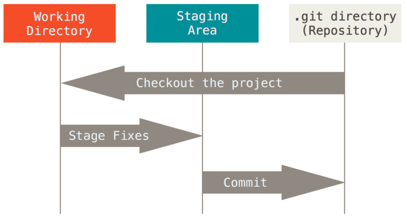

# [Git](https://git-scm.com/book/en/v2)

---

Este proyecto está enfocado netamente en trabajar con los distintos `comandos de GIT`, para eso nos apoyaremos de esta
aplicación de Spring Boot.

---

# Primeros pasos

---

## Los tres estados

Git tiene **tres estados principales** en los que pueden residir sus archivos: `modified, staged, y committed`:

- `modified`, significa que ha cambiado el archivo pero aún no lo ha enviado a su base de datos.
- `staged`, significa que ha marcado un archivo modificado en su versión actual para pasar a su próxima instantánea de
  commit.
- `committed`, significa que los datos están almacenados de forma segura en tu base de datos local.

Esto nos lleva a las **tres secciones principales de un proyecto Git**: `working directory`, `staging area` y el
`git directory`.



- El `working directory` es una verificación única de una versión del proyecto. Estos archivos se extraen de la base de
  datos comprimida en el directorio Git y se colocan en el disco para que usted pueda usarlos o modificarlos.
- El `staging area` (área de preparación) es un archivo, generalmente contenido en su directorio Git, que **almacena
  información sobre lo que se incluirá en su próximo commit**. Su nombre técnico en el lenguaje Git es **"index"**,
  pero la frase **"staging area"** (área de preparación) funciona igual de bien.
- El `git directory` es donde **Git almacena los metadatos y la base de datos de objetos para su proyecto**. Esta es la
  parte más importante de Git y es lo que se copia cuando clonas un repositorio desde otra computadora.

Si una versión particular de un archivo está en el `Git directory`, se considera en estado `committed`. Si ha sido
modificado y agregado al `staging area`(área de preparación), está en estado `staged` (preparación). Y si se cambió
desde que se desprotegió, pero no está en estado `staged` (preparado), entonces está en `modified`.

## Primeros pasos: configuración de Git por primera vez

Puede ver **todas sus configuraciones y de dónde provienen** si usamos el siguiente comando:

````bash
git config --list --show-origin
````

Establece nombre de usuario y correo:

````bash
git config --global user.name "John Doe"
git config --global user.email johndoe@example.com
````

Nuevamente, necesitas hacer esto solo una vez si pasas la opción `--global`, porque entonces Git siempre usará esa
información para cualquier cosa que hagas en ese sistema. Si desea anular esto con un nombre o dirección de correo
electrónico diferente para proyectos específicos, puede ejecutar el comando sin la opción --global cuando esté en ese
proyecto.

Ver configuraciones **globales**:

````bash
git config --global --list

core.editor="C:\Users\USUARIO\AppData\Local\Programs\Microsoft VS Code\bin\code" --wait
user.name=Martín
user.email=magadiflo@gmail.com
filter.lfs.smudge=git-lfs smudge -- %f
filter.lfs.process=git-lfs filter-process
filter.lfs.required=true
filter.lfs.clean=git-lfs clean -- %f
alias.lg=log --oneline --decorate --all --graph
alias.s=status -s -b
difftool.sourcetree.cmd=''
mergetool.sourcetree.cmd=''
mergetool.sourcetree.trustexitcode=true
````

Ver **todas** las configuraciones:

````bash
 git config --list
 
...
init.defaultbranch=main
core.editor="C:\Users\USUARIO\AppData\Local\Programs\Microsoft VS Code\bin\code" --wait
user.name=Martín
user.email=magadiflo@gmail.com
...
remote.origin.url=https://github.com/magadiflo/spring-boot-git-github.git
...
````

## Primeros pasos: obtener ayuda

Obtener **ayuda de la página web del manual** para algún comando git, por ejemplo, para el comando `config`:

````
git config --help
````

Si solo queremos un **repaso rápido de las opciones disponibles** para un comando Git, podemos usar `-h`. Por ejemplo,
nuevamente consultemos la **ayuda** pero esta véz **rápida** para el comando `config`:

````
git config -h

usage: git config [<options>]

Config file location
    --global              use global config file
    --system              use system config file
    --local               use repository config file
    --worktree            use per-worktree config file
...
````

---

# Conceptos básicos de Git

---

## Obtener un repositorio Git

**Inicialización de un repositorio en un directorio existente**: Si tiene un directorio de proyecto que actualmente no
está bajo control de versiones y desea comenzar a controlarlo con Git, primero debe ir al directorio de ese proyecto,
luego ejecutar `git init`:

````
M:\PROGRAMACION\DESARROLLO_GIT\documentacion_oficial\git-github-practice
git init

Initialized empty Git repository in M:/PROGRAMACION/DESARROLLO_GIT/documentacion_oficial/git-github-practice/.git/
````

Si desea comenzar a controlar las versiones de los archivos existentes (en lugar de un directorio vacío), probablemente
debería comenzar a rastrear esos archivos y realizar una confirmación inicial. Puedes lograrlo con algunos comandos de
git add que especifican los archivos que deseas rastrear, seguidos de una confirmación de git:

````
git add *.c
git add LICENSE
git commit -m 'Initial project version'
````

**Clonando un repositorio existente**: Si desea obtener una copia de un repositorio Git existente, por ejemplo, un
proyecto en el que le gustaría contribuir, el comando que necesita es `git clone`:

````
git clone <url>
git clone https://github.com/magadiflo/spring-boot-git-github.git
````