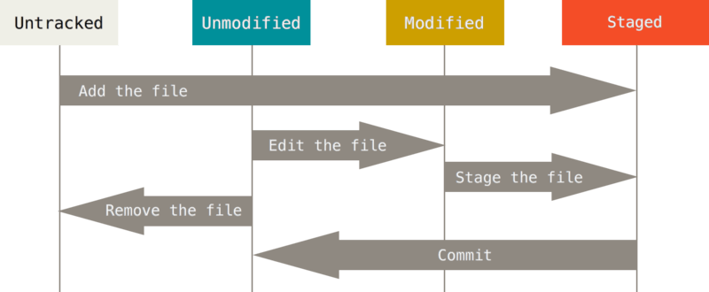
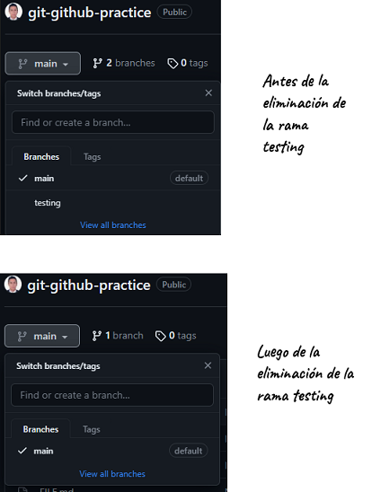
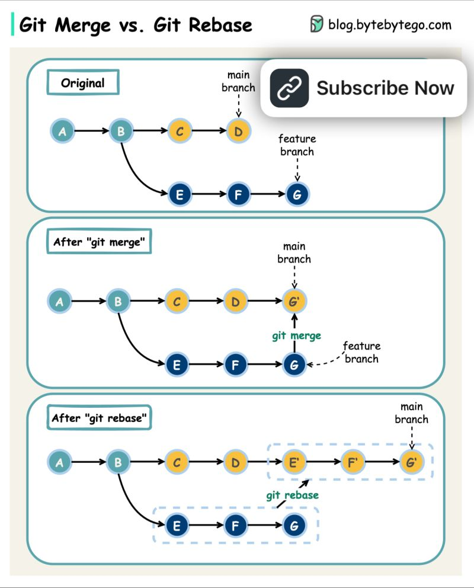
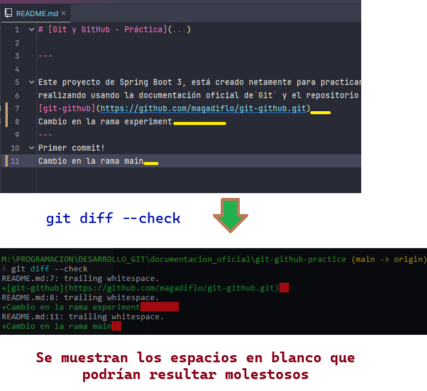
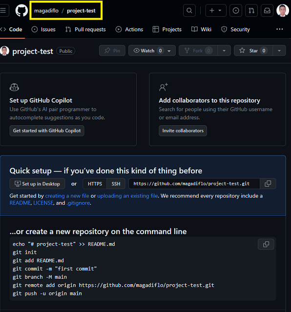
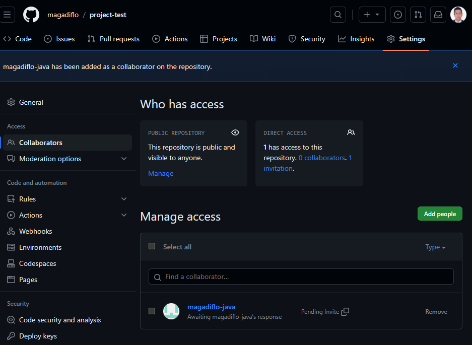

# [Git](https://git-scm.com/book/en/v2)

---

Este proyecto está enfocado netamente en trabajar con los distintos `comandos de GIT`, para eso nos apoyaremos de esta
aplicación de Spring Boot.

---

# Primeros pasos

---

## Los tres estados

Git tiene **tres estados principales** en los que pueden residir sus archivos: `modified, staged, y committed`:

- `modified`, significa que ha cambiado el archivo pero aún no lo ha enviado a su base de datos.
- `staged`, significa que ha marcado un archivo modificado en su versión actual para pasar a su próxima instantánea de
  commit.
- `committed`, significa que los datos están almacenados de forma segura en tu base de datos local.

Esto nos lleva a las **tres secciones principales de un proyecto Git**: `working directory`, `staging area` y el
`git directory`.


- El `working directory` es una verificación única de una versión del proyecto. Estos archivos se extraen de la base de
  datos comprimida en el directorio Git y se colocan en el disco para que usted pueda usarlos o modificarlos.
- El `staging area` (área de preparación) es un archivo, generalmente contenido en su directorio Git, que **almacena
  información sobre lo que se incluirá en su próximo commit**. Su nombre técnico en el lenguaje Git es **"index"**,
  pero la frase **"staging area"** (área de preparación) funciona igual de bien.
- El `git directory` es donde **Git almacena los metadatos y la base de datos de objetos para su proyecto**. Esta es la
  parte más importante de Git y es lo que se copia cuando clonas un repositorio desde otra computadora.

Si una versión particular de un archivo está en el `Git directory`, se considera en estado `committed`. Si ha sido
modificado y agregado al `staging area`(área de preparación), está en estado `staged` (preparación). Y si se cambió
desde que se desprotegió, pero no está en estado `staged` (preparado), entonces está en `modified`.

## Primeros pasos: configuración de Git por primera vez

Puede ver **todas sus configuraciones y de dónde provienen** si usamos el siguiente comando:

````bash
$ git config --list --show-origin
````

Establece nombre de usuario y correo:

````bash
$ git config --global user.name "John Doe"
$ git config --global user.email johndoe@example.com
````

Nuevamente, necesitas hacer esto solo una vez si pasas la opción `--global`, porque entonces Git siempre usará esa
información para cualquier cosa que hagas en ese sistema. Si desea anular esto con un nombre o dirección de correo
electrónico diferente para proyectos específicos, puede ejecutar el comando sin la opción --global cuando esté en ese
proyecto.

Ver configuraciones **globales**:

````bash
$ git config --global --list

core.editor="C:\Users\USUARIO\AppData\Local\Programs\Microsoft VS Code\bin\code" --wait
user.name=Martín
user.email=magadiflo@gmail.com
filter.lfs.smudge=git-lfs smudge -- %f
filter.lfs.process=git-lfs filter-process
filter.lfs.required=true
filter.lfs.clean=git-lfs clean -- %f
alias.lg=log --oneline --decorate --all --graph
alias.s=status -s -b
difftool.sourcetree.cmd=''
mergetool.sourcetree.cmd=''
mergetool.sourcetree.trustexitcode=true
````

Ver **todas** las configuraciones:

````bash
$ git config --list
 
...
init.defaultbranch=main
core.editor="C:\Users\USUARIO\AppData\Local\Programs\Microsoft VS Code\bin\code" --wait
user.name=Martín
user.email=magadiflo@gmail.com
...
remote.origin.url=https://github.com/magadiflo/spring-boot-git-github.git
...
````

## Primeros pasos: obtener ayuda

Obtener **ayuda de la página web del manual** para algún comando git, por ejemplo, para el comando `config`:

````bash
$ git config --help
````

Si solo queremos un **repaso rápido de las opciones disponibles** para un comando Git, podemos usar `-h`. Por ejemplo,
nuevamente consultemos la **ayuda** pero esta véz **rápida** para el comando `config`:

````bash
$ git config -h

usage: git config [<options>]

Config file location
    --global              use global config file
    --system              use system config file
    --local               use repository config file
    --worktree            use per-worktree config file
...
````

---

# Conceptos básicos de Git

---

## Obtener un repositorio Git

**Inicialización de un repositorio en un directorio existente**: Si tiene un directorio de proyecto que actualmente no
está bajo control de versiones y desea comenzar a controlarlo con Git, primero debe ir al directorio de ese proyecto,
luego ejecutar `git init`:

````bash
M:\PROGRAMACION\DESARROLLO_GIT\documentacion_oficial\git-github-practice
$ git init

Initialized empty Git repository in M:/PROGRAMACION/DESARROLLO_GIT/documentacion_oficial/git-github-practice/.git/
````

Si desea comenzar a controlar las versiones de los archivos existentes (en lugar de un directorio vacío), probablemente
debería comenzar a rastrear esos archivos y realizar una confirmación inicial. Puedes lograrlo con algunos comandos de
git add que especifican los archivos que deseas rastrear, seguidos de una confirmación de git:

````bash
$ git add *.c
$ git add LICENSE
$ git commit -m 'Initial project version'
````

**Clonando un repositorio existente**: Si desea obtener una copia de un repositorio Git existente, por ejemplo, un
proyecto en el que le gustaría contribuir, el comando que necesita es `git clone <url>`:

````bash
$ git clone https://github.com/magadiflo/spring-boot-git-github.git
````

## Registrando cambios en el repositorio

Recuerde que cada archivo en su directorio de trabajo puede estar en uno de dos estados: `tracked o untracked` (con
seguimiento o sin seguimiento). Los archivos `tracked` son archivos que Git conoce, es decir que ya está dándole
seguimiento.



### Comprobación del estado de los archivos

````
git status                    <-- Ver el estado con información completa
git status -s                 <-- Ver el estado de maner más compacta
git status --short            <-- --short es la forma completa del -s

git status -s -b              <-- Ver el estado junto a la rama
git status --short --branch   <-- --branch es la forma completa del -b
````

### Seguimiento de archivos nuevos

Para empezar a hacer **tracking** (seguimiento) de los archivos:

````
git add User.java   <-- Agrega el archivo User.java
git add *.html      <-- Agrega todos los archivos que tienen extensión .html
git add .           <-- Agrega todos los archivos
````

### Preparación de archivos modificados

Cuando un archivo ya es conocido por Git (`tracked`) y se hace una modificación se puede usar nuevamente el comando
`git add` para agregarlo al área de preparación (`staging area`).

### Ignorando archivos

Para ignorar aquellos archivos que **nos queremos que Git de seguimiento**, podemos crear un archivo llamado
`.gitignore` y agregarlo a la raíz del proyecto:

````gitignore
HELP.md
target/

### IntelliJ IDEA ###
.idea
*.iws
*.iml
*.ipr
````

**NOTA**
> En el caso simple, **un repositorio podría tener un único archivo** `.gitignore` en su **directorio raíz**, que **se
> aplica de forma recursiva a todo el repositorio**. Sin embargo, **también es posible tener archivos** `.gitignore`
> **adicionales en subdirectorios**. Las reglas de estos archivos .gitignore anidados **se aplican solo a los
> archivos del directorio donde se encuentran**.

### Visualización de cambios en Staged and Unstaged (preparados y no preparados)

Visualizar **qué cambios se han realizado**, no solo qué archivos cambiaron. Para eso usamos el comando `git diff` para
mostrar las líneas exactas agregadas y eliminadas:

````bash
$ git diff
````

Si ejecutamos el comando `git diff` veremos los **cambios que se han realizado a los archivos modificados**, pero que
aún no se han agregado al staging area:

````bash
$ git status -s -b
## main...origin/main
 M CONTRIBUTING.md
M  README.md
````

````bash
$ git diff
diff --git a/CONTRIBUTING.md b/CONTRIBUTING.md
index 8dea0e2..1c5d7a7 100644
--- a/CONTRIBUTING.md
+++ b/CONTRIBUTING.md
@@ -1,3 +1,3 @@
 # Archivo de contribución

-Archivo de Marckdown
\ No newline at end of file
+Archivo de contribución.
\ No newline at end of file
````

**NOTA 1**
> `??`, indica que es un archivo nuevo que aún no está siendo rastreado.<br>
> `A`, indica que es un nuevo archivo el que se ha agregado al staging area.<br>
> `M`, indica que es un archivo modificado.<br>

**NOTA 2**
> La columna de la **izquierda** indica el **estado del área de preparación** y la columna de la **derecha** indica el
> estado del **working directory**.
>
> En el resultado anterior observamos que el archivo `CONTRIBUTING.md` tiene una `M` en la columna derecha, lo que
> indica que el archivo está en estado de preparación (staging area), mientras que el archivo `README.md` tiene la `M`
> en la columna izquierda, lo que indica que ha sido modificado y está en el working directory.

Si queremos ver lo que está en el `staging area` y que será incluido en el próximo commit, podemos usar el mismo comando
anterior agregando `--staged`:

````bash
$ git diff --staged
diff --git a/README.md b/README.md
index 316739e..d581f1f 100644
--- a/README.md
+++ b/README.md
@@ -2,6 +2,8 @@

 ---

+**Descripción General:**
+
 Este proyecto de Spring Boot 3, está creado netamente para practicar con `Git y GitHub`. Esta práctica la estoy
 realizando usando la documentación oficial de`Git` y mi repositorio donde estoy detallando los pasos seguidos es en
 [git-github](https://github.com/magadiflo/git-github.git).
````

### Confirmar sus cambios

Para commitear los cambios del staging area y agregarlos al git directory:

````bash
$ git commit -m "Primer cambio"
````

### Eliminando archivos

Para eliminar un archivo de Git, debe eliminarlos de sus archivos rastreados (tracked) y luego hacer un commit.

### Ejemplo 1: Eliminando archivo con rm

Veamos el siguiente ejemplo donde eliminaremos el archivo `PROJECTS.md`, pero antes, usando el comando de linux `ls`
mostramos todos los archivos contenidos en el directorio actual:

````bash
$ ls
HELP.md  mvnw*  mvnw.cmd  pom.xml  PROJECTS.md  README.md  src/
````

Ahora, utilizando el comando de la terminal de linux `rm` eliminaremos el archivo `PROJECTS.md` y luego ejecutamos
el comando para ver el estado de los mismos:

````bash
$ rm PROJECTS.md

$ git status
Changes not staged for commit:
        deleted:    PROJECTS.md
````

Si observamos en el resultado anterior nos muestra el mensaje **"Changes not staged for commit"**, es decir que tenemos
**cambios que aún no están preparados para hacer commit**. Por lo tanto, agregamos los cambios al staging area y luego
vemos el estado de los archivos:

````bash
$ git add .

$ git status
Changes to be committed:
        deleted:    PROJECTS.md
````

Ahora, observamos en el resultado anterior que **los cambios están listos para ser commiteados**.

### Ejemplo 2: Eliminando archivo con git rm

Eliminar el archivo con el comando `git rm`, **no solo elimina el archivo**, sino que **lo deja preparado en el
staging area**, evitando hacer más pasos como en el caso anterior:

````bash
$ ls
HELP.md  mvnw*  mvnw.cmd  pom.xml  PROJECTS.md  README.md  src/
````

Ahora eliminamos el archivo `PROJECTS.md` y ese cambio será **colocado directamente en el staging area**:

````bash
$ git rm PROJECTS.md
rm 'PROJECTS.md'

$ git status
Changes to be committed:
        deleted:    PROJECTS.md
````

**NOTA 1**
> Como observamos, al final tanto el ejemplo 1 y 2 llegan al mismo resultado, la diferencia está en que en el ejemplo
> 2 solo se usa un comando `git rm` mientras que el ejemplo 1 se usan más comandos.

**NOTA 2**

> Si **elimino el archivo manualmente**, es decir vamos al directorio donde se encuentra el archivo, lo seleccionamos y
> lo eliminamos, estaríamos en el caso de la eliminación del `ejemplo 1`.
>
> Pero si uso `IntelliJ IDEA` y desde el IDE selecciono el archivo y presiono la tecla `del` para eliminarlo, en este
> caso el IDE aplica la eliminación del `ejemplo 2`.

### Ejemplo 3: eliminar archivo del staging area pero conservarlo en el working directory

Otra cosa útil que quizás quieras hacer es mantener el archivo en tu `working directory` pero `eliminarlo de tu
staging area`. En otras palabras, es posible que desee conservar el archivo en su disco duro, pero `que Git ya no lo
rastree`. Esto es particularmente útil si olvidó agregar algo a su archivo .gitignore y accidentalmente lo preparó
(staged). Para hacer esto, use la opción `--cached`:

````bash
$ ls
HELP.md  mvnw*  mvnw.cmd  pom.xml  PROJECTS.md  README.md  src/

$ git rm --cached PROJECTS.md
rm 'PROJECTS.md'

$ git status
Changes to be committed:
        deleted:    PROJECTS.md

Untracked files:
        PROJECTS.md
````

Luego de aplicar el comando anterior, el archivo `PROJECTS.md` aún se mantiene físicamente en el directorio actual y eso
es gracias a la bandera `--cached`. En pocas palabras, le dijimos a git que deje de rastrear al archivo `PROJECTS.md`
(eso se verá reflejado cuando hagamos commit, por el momento ese cambio solo está preparado en el staging area, por eso
el mensaje **Changes to be committed**) y lo mantenga en el directorio **como un nuevo archivo agregado sin
seguimiento (untracked)**.

### Renombrando archivos (mover archivos)

### Ejemplo 1: Renombrando archivo con mv

`mv` es un **comando de consola de linux que permite mover o renombrar** archivos y directorios.

Al igual que hicimos en el ejemplo del eliminar, en este ejemplo, **para renombrar los archivos también podemos ejecutar
una serie de pasos**:

````bash
$ ls
FILE.md  HELP.md  mvnw*  mvnw.cmd  pom.xml  PROJECTS.md  README.md  src/

$ mv FILE.md MY_FILE.md

$ git status
Changes not staged for commit:
        deleted:    FILE.md

Untracked files:
        MY_FILE.md
        
$ git rm FILE.md
rm 'FILE.md'

$ git status
Changes to be committed:
        deleted:    FILE.md

Untracked files:
        MY_FILE.md
        
$ git add MY_FILE.md

$ git status
Changes to be committed:
        renamed:    FILE.md -> MY_FILE.md
````

El ejemplo anterior muestra paso a paso el proceso de renombrado, pero en resumen estos serían los comandos ejecutados:

````bash
$ mv FILE.md MY_FILE.md
$ git rm FILE.md
$ git add MY_FILE.md
````

### Ejemplo 2: Renombrando archivo con git mv

Si desea **cambiar el nombre de un archivo en Git**, puede ejecutar algo como `git mv file_from file_to`.

A continuación, **renombraremos** el archivo `FILE.md` a `MY_FILE.md`, previamente listamos los archivos del directorio:

````bash
$ ls
FILE.md  HELP.md  mvnw*  mvnw.cmd  pom.xml  PROJECTS.md  README.md  src/

$ git mv FILE.md MY_FILE.md

$ git status
Changes to be committed:
        renamed:    FILE.md -> MY_FILE.md
````

Como observamos el archivo fue renombrado `(renamed)` y está en el estado de `staged`.

**NOTA**

> Git se da cuenta de que se trata de un cambio de nombre implícito, por lo que no importa si cambia el nombre de un
> archivo de esa manera o con el comando mv.
>
> **La única diferencia real es que git mv es un comando en lugar de tres**: es una función de conveniencia. Más
> importante aún, **puede utilizar cualquier herramienta que desee para cambiar el nombre de un archivo** y abordar el
> add/rm más tarde, antes de confirmar.

## Visualización del historial de commits

### Viendo el historial de commits

Ver el **historial de commits**:

````bash
$ git log

commit 843428eb126d62da12ad7fda6c44dc12112bb8df
Author: Martín <magadiflo@gmail.com>
Date:   Fri Sep 15 13:24:27 2023 -0500

    Agregando archvo PROJECTS.md

commit 104cb823b8b2bd8da1b1cc377a0067e559bf10fc
Author: Martín <magadiflo@gmail.com>
Date:   Fri Sep 15 10:39:57 2023 -0500

    Inicio
````

Existe una gran cantidad y variedad de opciones para el comando `git log` están disponibles para mostrarte exactamente
lo que estás buscando. Aquí te mostraremos algunos de los más populares.

El uso de`-p` o `--patch` muestra la **diferencia (salida del parche) introducida en cada commit**. También puede
limitar la cantidad de entradas de registro que se muestran, como usar `-2` para **mostrar solo las dos últimas
entradas:**

````bash
$ git log -p -2
commit de7978cff269dd1f52b71692debf454f78d7180c
Author: Martín <magadiflo@gmail.com>
Date:   Fri Sep 15 23:13:55 2023 -0500

    Nuevos cambios en los archivos Markdown

diff --git a/FILE.md b/FILE.md
deleted file mode 100644
index e69de29..0000000
diff --git a/MY_FILE.md b/MY_FILE.md
new file mode 100644
index 0000000..b9fc54e
--- /dev/null
+++ b/MY_FILE.md
@@ -0,0 +1 @@
+# Mi nuevo archivo
\ No newline at end of file
diff --git a/README.md b/README.md
index 5873f96..021c543 100644
--- a/README.md
+++ b/README.md
@@ -2,8 +2,10 @@

 ---

-Este proyecto de Spring Boot 3, está creado netamente para practicar con `Git y GitHub`. Esta práctica la estoy
+Este proyecto está creado netamente para practicar con `Git y GitHub`. Esta práctica la estoy
 realizando usando la documentación oficial de`Git` y el repositorio donde estoy detallando los pasos seguidos es en
 [git-github](https://github.com/magadiflo/git-github.git)

----
\ No newline at end of file
+---
+
+Historial de Commits
\ No newline at end of file

commit a1de54eed0176e6ff32b2804d5ed1a294a8be31b (origin/main)
Author: Martín <magadiflo@gmail.com>
Date:   Fri Sep 15 20:03:44 2023 -0500

    Archivo renombrado

diff --git a/MY_FILE.md b/FILE.md
similarity index 100%
rename from MY_FILE.md
rename to FILE.md
````

Ver algunas **estadísticas abreviadas para cada commit**, puede usar la opción `--stat`:

````bash
$ git log --stat -2
commit de7978cff269dd1f52b71692debf454f78d7180c (HEAD -> main)
Author: Martín <magadiflo@gmail.com>
Date:   Fri Sep 15 23:13:55 2023 -0500

    Nuevos cambios en los archivos Markdown

 FILE.md    | 0
 MY_FILE.md | 1 +
 README.md  | 6 ++++--
 3 files changed, 5 insertions(+), 2 deletions(-)

commit a1de54eed0176e6ff32b2804d5ed1a294a8be31b (origin/main)
Author: Martín <magadiflo@gmail.com>
Date:   Fri Sep 15 20:03:44 2023 -0500

    Archivo renombrado

 MY_FILE.md => FILE.md | 0
 1 file changed, 0 insertions(+), 0 deletions(-)
````

Como puede ver, la opción `--stat` imprime debajo de cada entrada de confirmación una lista de archivos modificados,
cuántos archivos se cambiaron y cuántas líneas en esos archivos se agregaron y eliminaron. También pone un resumen de la
información al final.

Mostrar la **lista de los archivos modificados** después de la información del commit:

````bash
$ git log --name-only -2
commit de7978cff269dd1f52b71692debf454f78d7180c (HEAD -> main)
Author: Martín <magadiflo@gmail.com>
Date:   Fri Sep 15 23:13:55 2023 -0500

    Nuevos cambios en los archivos Markdown

FILE.md
MY_FILE.md
README.md

commit a1de54eed0176e6ff32b2804d5ed1a294a8be31b (origin/main)
Author: Martín <magadiflo@gmail.com>
Date:   Fri Sep 15 20:03:44 2023 -0500

    Archivo renombrado

FILE.md
````

Ver cada **commit en una sola línea** usando `--pretty=oneline`:

````bash
$ git log --pretty=oneline
de7978cff269dd1f52b71692debf454f78d7180c Nuevos cambios en los archivos Markdown
a1de54eed0176e6ff32b2804d5ed1a294a8be31b Archivo renombrado
1449f19a78991a1bf871821ab0be50fd8cb2c68b Archivo renombrado
b736e0ae3ed627d1772c5fc9bbeedf92e41f9efa Nuevo archivo FILE.md
843428eb126d62da12ad7fda6c44dc12112bb8df Agregando archvo PROJECTS.md
104cb823b8b2bd8da1b1cc377a0067e559bf10fc Inicio
````

Ver cada **commit en una sola línea** usando `--pretty=oneline --abbrev-commit` o que es lo mismo, su equivalente
`--oneline`:

````bash
$ git log --oneline
de7978c (HEAD -> main, origin/main) Nuevos cambios en los archivos Markdown
a1de54e Archivo renombrado
1449f19 Archivo renombrado
b736e0a Nuevo archivo FILE.md
843428e Agregando archvo PROJECTS.md
104cb82 Inicio
````

Especificar una **salida de formato personalizado:**

````bash
$ git log --pretty=format:"%h - %an, %ar : %s"
de7978c - Martín, 19 minutes ago : Nuevos cambios en los archivos Markdown
a1de54e - Martín, 4 hours ago : Archivo renombrado
1449f19 - Martín, 4 hours ago : Archivo renombrado
b736e0a - Martín, 4 hours ago : Nuevo archivo FILE.md
843428e - Martín, 10 hours ago : Agregando archvo PROJECTS.md
104cb82 - Martín, 13 hours ago : Inicio
````

Los valores de las opciones `oneline y format` son particularmente útiles con otra opción de registro llamada `--graph`.
Esta opción agrega un pequeño y agradable gráfico ASCII que muestra su historial de branch y merge:

````bash
$ git log --pretty=format:"%h %s" --graph
* de7978c Nuevos cambios en los archivos Markdown
* a1de54e Archivo renombrado
* 1449f19 Archivo renombrado
* b736e0a Nuevo archivo FILE.md
* 843428e Agregando archvo PROJECTS.md
* 104cb82 Inicio
````

Ver **historial de commits** sin mostrar los **merge commits**, esto es simplemente para evitar que la visualización de
commits de fusión abarrote su historial de logs:

````bash
$ git log --oneline --no-merges
bc616b3 (HEAD -> feature/git-basics) Registrando cambios en el repositorio
46b9424 Conceptos básicos: obtener un repositorio Git
60e5b0e (origin/feature/getting-started, feature/getting-started) Primeros pasos: obtener ayuda
5675752 Primeros pasos: configuración de git por primera vez
17237cc Inicio
````

### Limitar la salida del Log

Podemos limitar la salida a un subconjunto de commits. Ya has visto una de esas opciones: `la opción -2`, que **muestra
solo las dos últimas confirmaciones**. De hecho, puedes hacer `-<n>`, **donde n es cualquier número entero** para
mostrar las últimas n confirmaciones.

Ver la **lista de commits** realizadas en las últimas dos semanas:

````bash
$ git log --since=2.weeks
commit de7978cff269dd1f52b71692debf454f78d7180c (HEAD -> main, origin/main)
Author: Martín <magadiflo@gmail.com>
Date:   Fri Sep 15 23:13:55 2023 -0500

    Nuevos cambios en los archivos Markdown
....
````

## Deshacer cosas

**Rehacer el commit anterior** usando la opción `--amend`. En el ejemplo siguiente, hemos realizado cambios
en los archivos PROJECTS.md y README.md y queremos hacer un commit de ellos:

````bash
$ git status -s -b
## main...origin/main
 M PROJECTS.md
 M README.md

$ git add .

$ git commit -m "Modificando archivos: README.md y PROJECTS.md"
[main 36ae970] Modificando archivos: README.md y PROJECTS.md
 2 files changed, 4 insertions(+), 2 deletions(-)

$ git log --name-only -2
commit 36ae970848ade5b660e97dfb1284d6ac2d59a4d3 (HEAD -> main)
Author: Martín <magadiflo@gmail.com>
Date:   Mon Sep 18 11:15:44 2023 -0500

    Modificando archivos: README.md y PROJECTS.md

PROJECTS.md
README.md

commit b736e0ae3ed627d1772c5fc9bbeedf92e41f9efa (origin/main)
Author: Martín <magadiflo@gmail.com>
Date:   Fri Sep 15 19:49:33 2023 -0500

    Nuevo archivo FILE.md

FILE.md
````

A partir de aquí nos damos cuenta de que **nos olvidamos de agregar un cambio, por ejemplo, nos olvidamos de agregar
el archivo HISTORY.md y además el mensaje del commit no era el que queríamos**, por lo que procedemos a realizar lo
siguiente:

````bash
$ git status -s -b
?? HISTORY.md

$ git add .

$ git commit --amend -m "Modificando archivos: README.md y PROJECTS.md - Agregando archivo HISTORY.md"
[main 306d52b] Modificando archivos: README.md y PROJECTS.md - Agregando archivo HISTORY.md
 Date: Mon Sep 18 11:15:44 2023 -0500
 3 files changed, 5 insertions(+), 2 deletions(-)
 create mode 100644 HISTORY.md
 
$ git log --name-only -2
commit 306d52b2973c845159037963075d9a10f496f729 (HEAD -> main)
Author: Martín <magadiflo@gmail.com>
Date:   Mon Sep 18 11:15:44 2023 -0500

    Modificando archivos: README.md y PROJECTS.md - Agregando archivo HISTORY.md

HISTORY.md
PROJECTS.md
README.md

commit b736e0ae3ed627d1772c5fc9bbeedf92e41f9efa (origin/main)
Author: Martín <magadiflo@gmail.com>
Date:   Fri Sep 15 19:49:33 2023 -0500

    Nuevo archivo FILE.md

FILE.md
````

Como observamos al usar el comando `git commit --amend -m "Modificando archivos: README.md y PROJ...."` **justo después
del commit anterior** lo que hace es **modificar el mensaje del commit anterior** y adicionalmente colocar el archivo
HISTORY.md que nos olvidamos agregar en el commit anterior. Por lo que, si revisamos el último commit veremos que
ya está nuestro nuevo mensaje y además también está el archivo HISTORY.md como parte del snapshot.

**NOTA**
> Es importante comprender que **cuando modifica su último commit**, no lo está arreglando sino **reemplazándolo por
> completo con un commit nuevo** y mejorado que elimina el commit anterior y coloca el nuevo commit en su lugar.
> Efectivamente, es como si el commit anterior nunca hubiera ocurrido y no aparecerá en el historial de su repositorio.

**IMPORTANTE**
> **Modifique únicamente los commits que aún sean locales y no hayan sido enviadas a ninguna parte. Modificar los
> commits enviados previamente y forzar el envío de la rama causará problemas a sus colaboradores.**

### Deshacer un archivo preparado

Las siguientes dos secciones demuestran cómo trabajar con su **staging area** y cambios en el **working directory**.
Lo bueno es que **el comando que utiliza para determinar el estado de esas dos áreas** también **le recuerda cómo
deshacer los cambios** en ellas.

Por ejemplo, tenemos los siguientes archivos agregados en el **staging area**:

````bash
$ git status
On branch main
Your branch is ahead of 'origin/main' by 1 commit.
  (use "git push" to publish your local commits)

Changes to be committed:
  (use "git restore --staged <file>..." to unstage)
        renamed:    FILE.md -> MY_FILE.md
        modified:   PROJECTS.md
        modified:   README.md
````

Justo debajo del texto **"Changes to be committed"**, dice use `"git restore --staged <file>..."` para cancelar la
etapa. En nuestro caso, por ejemplo, queremos quitar el archivo **README.md** del **staging area**, por lo que podemos
realizar lo siguiente:

````bash
$ git restore --staged README.md

$ git status
Changes to be committed:
  (use "git restore --staged <file>..." to unstage)
        renamed:    FILE.md -> MY_FILE.md
        modified:   PROJECTS.md

Changes not staged for commit:
  (use "git add <file>..." to update what will be committed)
  (use "git restore <file>..." to discard changes in working directory)
        modified:   README.md
````

Como observamos, ahora el archivo **README.md** ha dejado el **staging area** y se ha vuelto a colocar en el **working
directory**.

### Deshacer un archivo modificado

Supongamos que tenemos un archivo modificado en el **working directory**:

````bash
$ git status
Changes not staged for commit:
  (use "git add <file>..." to update what will be committed)
  (use "git restore <file>..." to discard changes in working directory)
        modified:   PROJECTS.md
````

**Queremos descartar el cambio realizado en ese archivo**. Si vemos el resultado anterior, **git nos está indicando de
manera muy explícita cómo descartar los cambios que hemos realizado.**

````bash
$ git restore PROJECTS.md

$ git status
On branch main
Your branch is up to date with 'origin/main'.

nothing to commit, working tree clean
````

Podemos observar que los cambios se han revertido.

**NOTA**
> En versiones anteriores de Git se usaba el comando `git checkout -- <file>...`, aunque aún se puede seguir utilizando.
> En mi caso optaré por utilizar, según el mensaje mostrado en el status: `git restore <file>...`

## Trabajar con repositorios remotos

### Viendo tus repositorios remotos

Para ver qué servidores remotos ha configurado, puede ejecutar el comando `git remote`. Enumera los nombres cortos de
cada identificador remoto que haya especificado. Si has clonado tu repositorio, al menos deberías ver `origin`, que es
el **nombre predeterminado que Git le da al servidor desde el que clonaste.**

````bash
$ git remote
origin
````

También podemos especificar `-v`, que muestra las URL que Git ha almacenado para el nombre corto que se usará al leer y
escribir en ese repositorio remoto:

````bash
$ git remote -v
origin  https://github.com/magadiflo/git-github-practice.git (fetch)
origin  https://github.com/magadiflo/git-github-practice.git (push)
````

### Agregar repositorio remoto

Para **agregar un nuevo repositorio remoto Git** como un nombre corto al que pueda hacer referencia fácilmente, ejecute
`git remote add <shortname> <url>`:

````bash
$ git remote
origin

$ git remote add pb https://github.com/paulboone/ticgit

$ git remote -v
origin	https://github.com/schacon/ticgit (fetch)
origin	https://github.com/schacon/ticgit (push)
pb	https://github.com/paulboone/ticgit (fetch)
pb	https://github.com/paulboone/ticgit (push)
````

Ahora puedes usar la cadena `pb` en la línea de comando en lugar de la URL completa.

**NOTA**
> Recordar que cuando creamos un repositorio local y luego queremos vincularlo a un repositorio remoto recién creado
> utilizamos el comando: `git remote add origin <url>`

### Eliminar referencia al repositorio remoto

Si en nuestro repositorio local tenemos una referencia al repositorio remoto y queremos eliminar esa referencia, podemos
usar el comando: `git remote rm <remote>`:

````bash
$ git remote -v
origin  https://github.com/magadiflo/git-github-practice.git (fetch)
origin  https://github.com/magadiflo/git-github-practice.git (push)
test    https://github.com/magadiflo/prueba.git (fetch)
test    https://github.com/magadiflo/prueba.git (push)

$ git remote rm test

$ git remote -v
origin  https://github.com/magadiflo/git-github-practice.git (fetch)
origin  https://github.com/magadiflo/git-github-practice.git (push)
````

**NOTA**

> `git remote rm` **no elimina el repositorio remoto del servidor.** Simplemente, elimina del repositorio local la
> referencia asociada al repositorio remoto.

## Etiquetado (Tag)

Normalmente, la gente usa esta funcionalidad para marcar puntos de versión (v1.0, v2.0, etc.). En esta sección,
aprenderá cómo enumerar las etiquetas existentes, cómo crear y eliminar etiquetas y cuáles son los diferentes tipos
de etiquetas.

### Listar sus tags

Para listar los tags podemos usar el comando `git tag` y agregarle de manera opcional `-l` o `--list`:

````bash
$ git tag
1.0.0
````

Podemos buscar tags que coincidan con un patrón en particular. Primero mostramos todos los tags y luego hacemos el
filtrado para ver la diferencia:

````bash
$  git tag
v1.0.0
v2.0.0
v2.1.0
v3.0.0
v4.0.0

$ git tag -l "v2*"
v2.0.0
v2.1.0
````

**NOTA**
> Si vamos a filtrar los tags, **aquí sí es obligatorio colocar previamente el -l o --list**, porque si no lo hacemos va
> a crear el tag que estemos colocando, cuando en realidad lo que queremos es buscar.

### Creando tags

Git admite dos tipos de etiquetas: **ligeras y anotadas**.

- **Una etiqueta ligeras** es muy parecida a una rama que no cambia: **es solo un puntero a un commit específico.**
- **Las etiquetas anotadas** se almacenan como objetos completos en la base de datos de Git. Están sumados de
  verificación; contienen el nombre del etiquetador, el correo electrónico y la fecha; tener un mensaje de etiquetado; y
  se puede firmar y verificar con GNU Privacy Guard (GPG). **Generalmente, se recomienda crear etiquetas anotadas para
  poder tener toda esta información;** pero si desea una etiqueta temporal o por alguna razón no desea conservar el
  resto de la información, también hay disponibles etiquetas ligeras.

### Etiquetas anotadas

La forma más sencilla es especificar `-a` cuando ejecuta el comando de etiqueta:

````bash
$ git tag -a v1.0 -m "Mi versión 1.0"

$ git tag
v1.0
````

Puede **ver los datos de la etiqueta** junto con el que se etiquetó mediante el comando `git show`:

````bash
$ git show v1.0
tag v1.0
Tagger: Martín <magadiflo@gmail.com>
Date:   Mon Sep 18 17:19:44 2023 -0500

Mi versión 1.0

commit b736e0ae3ed627d1772c5fc9bbeedf92e41f9efa (HEAD -> main, tag: v1.0, origin/main, test)
Author: Martín <magadiflo@gmail.com>
Date:   Fri Sep 15 19:49:33 2023 -0500

    Nuevo archivo FILE.md

diff --git a/FILE.md b/FILE.md
new file mode 100644
index 0000000..e69de29
````

### Etiquetas ligeras

Otra forma de etiquetar commits es con una etiqueta ligera. **Básicamente, esto consiste en utilizar el identificador
único del commit y no almacenar ninguna otra información en un archivo aparte.**. Para crear una etiqueta
liviana, no proporcione ninguna de las opciones -a, -s o -m, **solo proporcione un nombre de etiqueta:**

````bash
$ git tag v1.0-ligera

$ git tag
v1.0-ligera
````

Esta vez, si ejecuta `git show <etiqueta_ligera>`, no verá la información adicional de la etiqueta. El comando
simplemente muestra la confirmación:

````bash
$ git show v1.0-ligera
commit b736e0ae3ed627d1772c5fc9bbeedf92e41f9efa (HEAD -> main, tag: v1.0-ligera, origin/main, test)
Author: Martín <magadiflo@gmail.com>
Date:   Fri Sep 15 19:49:33 2023 -0500

    Nuevo archivo FILE.md

diff --git a/FILE.md b/FILE.md
new file mode 100644
index 0000000..e69de29
````

### Etiquetar más tarde

También puedes etiquetar commits después de haber avanzado más allá de ellas. Supongamos que tu historial de
confirmaciones luce de la siguiente manera:

````bash
$ git log --oneline
b736e0a (HEAD -> main, origin/main, test) Nuevo archivo FILE.md
843428e Agregando archvo PROJECTS.md
104cb82 Inicio
````

Ahora supongamos que por alguna razón se nos **"olvidó etiquetar el inicio"** del commit en la versión **v1.0**.
No hay ningún problema, podemos agregarle su etiqueta como creamos una etiqueta de siempre pero agregándole al
final el **código hash del commit** a ser etiquetado:

````bash
$ git tag -a v1.0 -m "Inicio del programa" 104cb82

$ git log --oneline
b736e0a (HEAD -> main, origin/main, test) Nuevo archivo FILE.md
843428e Agregando archvo PROJECTS.md
104cb82 (tag: v1.0) Inicio
````

### Compartir etiquetas

**De forma predeterminada, el comando git push no transfiere etiquetas a servidores remotos.** Tendrá que **enviar
etiquetas explícitamente** a un servidor compartido **después de haberlas creado.** Este proceso es como compartir
ramas remotas: puedes ejecutar `git push origin <tagname>`.

````bash
$ git push origin v1.0
Enumerating objects: 1, done.
Counting objects: 100% (1/1), done.
Writing objects: 100% (1/1), 170 bytes | 170.00 KiB/s, done.
Total 1 (delta 0), reused 0 (delta 0), pack-reused 0
To https://github.com/magadiflo/git-github-practice.git
 * [new tag]         v1.0 -> v1.0
````

Si tenemos muchos **tags** que deseamos subir a la vez, podemos usar la opción `--tags`:

````bash
$ git push origin --tags
Enumerating objects: 2, done.
Counting objects: 100% (2/2), done.
Delta compression using up to 8 threads
Compressing objects: 100% (2/2), done.
Writing objects: 100% (2/2), 294 bytes | 294.00 KiB/s, done.
Total 2 (delta 0), reused 0 (delta 0), pack-reused 0
To https://github.com/magadiflo/git-github-practice.git
 * [new tag]         v1.0 -> v1.0
 * [new tag]         v2.0 -> v2.0
````

Ahora, cuando alguien más clone o extraiga datos de su repositorio, también obtendrá todas sus etiquetas.

### Eliminar etiquetas

Para **eliminar una etiqueta en su repositorio local**, puede usar `git tag -d <tagname>`:

````bash
$ git tag -d v1.0
Deleted tag 'v1.0' (was 7f38a22)
````

Tenga en cuenta que **el comando anterior no elimina la etiqueta de ningún servidor remoto.** Existen dos variaciones
comunes para eliminar una etiqueta de un servidor remoto.

1. La primera variación es `git push <remote> :refs/tags/<tagname>`:
    ````bash
    $ git push origin :refs/tags/v2.0
      To https://github.com/magadiflo/git-github-practice.git
      - [deleted]         v2.0
   ````

2. La segunda forma (y más intuitiva) de eliminar una etiqueta remota es con:
    ````bash
      $ git push origin --delete v2.0
      To https://github.com/magadiflo/git-github-practice.git
      - [deleted]         v2.0
    ````

## Alias de Git

Si no desea escribir el texto completo de cada uno de los comandos de Git, puede configurar fácilmente un alias para
cada comando usando `git config`:

````bash
$ git config --global alias.lg6 "log --oneline --decorate --all --graph -6"

$ git config --global --list
core.editor="C:\Users\USUARIO\AppData\Local\Programs\Microsoft VS Code\bin\code" --wait
user.name=Martín
user.email=magadiflo@gmail.com
filter.lfs.smudge=git-lfs smudge -- %f
filter.lfs.process=git-lfs filter-process
filter.lfs.required=true
filter.lfs.clean=git-lfs clean -- %f
alias.lg=log --oneline --decorate --all --graph
alias.s=status -s -b
alias.lg6=log --oneline --decorate --all --graph -6
difftool.sourcetree.cmd=''
mergetool.sourcetree.cmd=''
mergetool.sourcetree.trustexitcode=true
````

Como observamos en el resultado anterior, hemos creado el alias `lg6` para mostrar el log de los últimos 6 commits y
otras características más que le da las otras configuraciones colocadas. Podemos observar también que nuestro alias
ya está registrado en las configuraciones globales junto a otros alias creados previamente como el `lg`, `s`.

Esto significa que, por ejemplo, en lugar de escribir `git log --oneline --decorate --all --graph -6`, solo
necesitamos escribir `git lg6`:

````bash
$ git log --oneline --decorate --all --graph -6
* 20b1166 (HEAD -> feature/git-basics) Eliminar etiqueta
* 18b9ff3 Compartir etiquetas
* c3008c5 Etiquetar más tarde
* e3e164b Etiquetas ligeras
* e3525cd Etiquetas anotadas
* bc18882 Listar tags

$ git lg6
* 20b1166 (HEAD -> feature/git-basics) Eliminar etiqueta
* 18b9ff3 Compartir etiquetas
* c3008c5 Etiquetar más tarde
* e3e164b Etiquetas ligeras
* e3525cd Etiquetas anotadas
* bc18882 Listar tags
````

Como puede ver, **Git simplemente reemplaza el nuevo comando con el alias** que le haya asignado.

## Git Branching: Las ramas en pocas palabras

La ramificación significa que te desvías de la línea principal de desarrollo y continúas trabajando sin alterar la línea
principal.

### Creando una nueva rama

Para **crear una nueva rama** usamos el comando `git branch <nueva_rama>`. Esto crea un nuevo puntero al mismo
commit en la que se encuentra actualmente:

````bash
$ git branch testing
````

### Cambiar de rama

Para cambiar a una rama existente, ejecuta el comando `git checkout <rama_destino>`. Esto mueve `HEAD` para apuntar a la
rama de testing.

````bash
$ git branch
* main
  testing
  
$ git checkout testing
Switched to branch 'testing'

$ git branch
  main
* testing

$ git lg
* b736e0a (HEAD -> testing, origin/main, main) Nuevo archivo FILE.md
* 843428e (tag: v2.0) Agregando archvo PROJECTS.md
* 104cb82 (tag: v1.0) Inicio
````

Podemos usar el siguiente comando git para imprimir el **historial de commits**, mostrándonos **dónde están los
punteros de rama** y cómo ha **divergido nuestro historial**:

````bash
$ git log --oneline --decorate --graph --all
* 5abaea2 (HEAD -> feature/git-branching) Creando nueva rama
| *   99110b6 (tag: v2.0.0, origin/main, main) Merge pull request #4 from magadiflo/release-2.0.0
| |\
| |/
|/|
* |   fd25905 (origin/release-2.0.0, origin/develop, release-2.0.0, develop) Merge pull request #3 from magadiflo/feature/git-basics
|\ \
| * | 667d65c (origin/feature/git-basics, feature/git-basics) Alias de Git
| * | 20b1166 Eliminar etiqueta
| * | 18b9ff3 Compartir etiquetas
| * | c3008c5 Etiquetar más tarde
| * | e3e164b Etiquetas ligeras
| * | e3525cd Etiquetas anotadas
| * | bc18882 Listar tags
| * | 5fe2226 Agregar repositorio remoto
| * | f5fe5ba Viendo tus repositorios remotos
| * | fd7d062 Deshacer un archivo modificado
| * | 67547d2 Deshacer un archivo preparado
| * | b3724d5 Deshacer cosas. Uso del --amend
| * | 4514cd9 Visualización del historial de commits
| * | bc616b3 Registrando cambios en el repositorio
| * | 46b9424 Conceptos básicos: obtener un repositorio Git
|/ /
| *   71806c1 (tag: 1.0.0) Merge pull request #2 from magadiflo/release-1.0.0
| |\
| |/
|/|
* |   681b273 (origin/release-1.0.0, release-1.0.0) Merge pull request #1 from magadiflo/feature/getting-started
|\ \
| |/
|/|
| * 60e5b0e (origin/feature/getting-started, feature/getting-started) Primeros pasos: obtener ayuda
| * 5675752 Primeros pasos: configuración de git por primera vez
|/
* 17237cc Inicio
````

**NOTA**
> El comando anterior, al ser demasiado grande ya lo tenía configurado con el alias `lg` en la configuración global
> de git.
>
> `--oneline`, para ver en una línea los commits.<br>
> `--decorate`, para ver hacia dónde apuntan los punteros de las ramas. Permite ver los nombres de las ramas y etiquetas
> que están asociadas a los commits, aunque **en versiones actuales de git las ramas y etiquetas se muestran de manera
> predeterminada, simplemente al hacer git log sin necesidad de --decorate**.<br>
> `--graph`, para mostrar las líneas como una especie de gráfico en la consola.<br>
> `--all`, muestra todas las ramas y sus commits.

Veamos el uso del `--all` con el siguiente ejemplo donde tengo el historial de commits mostrados:

````bash
$ git log --oneline
b736e0a (HEAD -> main, origin/main) Nuevo archivo FILE.md
843428e (tag: v2.0) Agregando archvo PROJECTS.md
104cb82 (tag: v1.0) Inicio
````

Nos moveremos al commit inicial `104cb82` y luego **ejecutaremos el log sin el --all**:

````bash
$ git checkout 104cb82

$  git log --oneline
104cb82 (HEAD, tag: v1.0) Inicio
````

Como observamos, solo nos muestra el historial hacia abajo a partir del commit en el que actualmente estamos. Aunque
como estamos en el primer commit, por debajo de él no hay más commits, entonces solo nos muestra ese primer commit.

Ahora, qué pasa si usamos el `--all`:

````bash
$ git log --oneline --all
b27daca (testing) Cambio en la rama testing
b736e0a (origin/main, main) Nuevo archivo FILE.md
843428e (tag: v2.0) Agregando archvo PROJECTS.md
104cb82 (HEAD, tag: v1.0) Inicio
````

Ahora vemos que no solo nos muestra que el `HEAD` está apuntando al commit donde nos movimos anteriormente, sino que
también nos muestra todos los demás commits.

### Crear una rama y cambiar al mismo tiempo

Es típico crear una nueva rama y querer cambiar a esa nueva rama al mismo tiempo. Esto se puede hacer en una sola
operación con `git checkout -b <newbranchname>`.

````bash
$ git branch
* main

$ git checkout -b testing
Switched to a new branch 'testing'

$ git branch
  main
* testing
````

A partir de la versión 2.23 de Git puedes usar `git switch` en lugar de `git checkout` para:

- Crear una nueva rama y cambiar a ella `git switch -c new-branch` (`-c` o `--create`):
  ````bash
  git branch
  * main

  $ git switch -c testing
  Switched to a new branch 'testing'
  
  $ git branch
  main
  * testing
  ````
- Cambiar a una rama existente `git switch destination_branch`:
  ````bash
  $ git branch
  main
  * testing

  $ git switch main
  Switched to branch 'main'
  Your branch is up to date with 'origin/main'.
  
  $ git branch
  * main
    testing
  ````

### Eliminar una rama en local

Para **eliminar una rama en nuestro repositorio local** debemos estar posicionados en una rama distinta a la que vamos a
eliminar. Por ejemplo, si tengo dos ramas `main` y `testing`, y quiero eliminar la rama `testing`, entonces debemos
posicionarnos en la rama `main` desde donde ejecutaremos el siguiente comando `git branch -d testing`:

````bash
$ git branch
* main
  testing

M:\PROGRAMACION\DESARROLLO_GIT\documentacion_oficial\git-github-practice (main -> origin)
$ git branch -d testing
Deleted branch testing (was b736e0a).

$ git branch
* main
````

Si queremos eliminar una rama que tiene cambios commiteados que aún no han sido mergeados con la rama principal, nos
saldrá el mensaje `error: La rama 'testing' no está completamente fusionada. Si está seguro de que desea eliminarla,
ejecute 'git branch -D testing'.` Es decir, si a nosotros ya no nos interesa la rama que queremos eliminar ni mucho
menos los cambios que en él hemos realizado y aún no están mergeados, entonces usamos el `-D`:

````bash
$ git lg
* 2a63312 (testing) Cambio en rama testing
* b736e0a (HEAD -> main, origin/main) Nuevo archivo FILE.md
* 843428e (tag: v2.0) Agregando archvo PROJECTS.md
* 104cb82 (tag: v1.0) Inicio

$ git branch -d testing
error: The branch 'testing' is not fully merged.
If you are sure you want to delete it, run 'git branch -D testing'.

$ git branch -D testing
Deleted branch testing (was 2a63312).

$ git branch
* main
````

### Eliminar una rama en remoto

Para eso ejecutamos el comando `git push <remote> --delete <rama_remota_a_eliminar>`:

````bash
$ git branch -a
* main
  testing
  remotes/origin/main
  remotes/origin/testing

$ git branch -d testing
Deleted branch testing (was b736e0a).

$ git branch -a
* main
  remotes/origin/main
  remotes/origin/testing

$ git push origin --delete testing
To https://github.com/magadiflo/git-github-practice.git
 - [deleted]         testing

$ git branch -a
* main
  remotes/origin/main
````

En los comandos anteriores, primero se está listando todas las ramas (locales y remotos) luego eliminamos la rama
local `testing` y luego eliminamos la rama remota `testing`.

También podemos usar el **comando corto para eliminar una rama remota** `git push <remote> :<rama_remota_a_eliminar>`:

````bash
$ git branch -a
* main
  testing
  remotes/origin/main
  remotes/origin/testing

$ git push origin :testing
To https://github.com/magadiflo/git-github-practice.git
 - [deleted]         testing

$ git branch -a
* main
  testing
  remotes/origin/main
````

En la imagen siguiente vemos el antes y después de esa eliminación:



## Bifurcación y fusión básicas (Branching y Merging)

### Ramificación básica (Basic Branching)

Tenemos el siguiente historial de commits y branches:

````bash
$ git lg
* ed0155b (HEAD -> hotfix) C4 - Documentación corregida
| * 8026c51 (iss53) C3 - Creando nuevo ProductController
|/
* 6be8a4d (origin/main, main) C2 - Segundo commit
* 4a1d91c C1 - Primer commit
* 104cb82 Inicio
````

Ahora, podemos hacer un `merge` para fusionar la rama `hotfix` con la rama `main`. Recordar que previamente debemos
posicionarnos en la rama que absorberá a la otra rama:

````bash
$ git checkout main
Switched to branch 'main'
Your branch is up to date with 'origin/main'.

$ git merge hotfix
Updating 6be8a4d..ed0155b
Fast-forward
 README.md | 3 +--
 1 file changed, 1 insertion(+), 2 deletions(-)

$ git lg
* ed0155b (HEAD -> main, hotfix) C4 - Documentación corregida
| * 8026c51 (iss53) C3 - Creando nuevo ProductController
|/
* 6be8a4d (origin/main) C2 - Segundo commit
* 4a1d91c C1 - Primer commit
* 104cb82 Inicio
````

Notarás la frase `"Fast-forward"` en esa fusión. Como la confirmación C4 apuntada por la rama hotfix que has fusionado
estaba directamente por delante de la confirmación C2 en la que te encuentras, **Git simplemente mueve el puntero hacia
delante.** Para decirlo de otra forma, **cuando intentas fusionar una confirmación con otra a la que se puede llegar
siguiendo el historial de la primera confirmación**, Git simplifica las cosas moviendo el puntero hacia delante porque
no hay trabajo divergente que fusionar - esto se llama un **"fast-forward".**

**NOTA**
> Si observamos en el commit `6be8a4d` tengo la rama `origin/main`, esta rama hace referencia a la rama remota, es
> decir, nuestra rama remota `origin/main` tiene los commits hasta este punto. Mientras que la **fusión (merge)** que
> hemos realizado con la rama `hotfix` y `main` ha ocurrido en nuestro **repositorio local**, eso también incluye
> la creación de la otra rama el `iss53`, está en local.

Una vez fusionada la rama `hotfix en main` podemos eliminar la rama `hotfix` ya no la necesitamos porque ya la tenemos
fusionada en `main`:

````bash
$ git branch -d hotfix 

$ git lg
* ed0155b (HEAD -> main) C4 - Documentación corregida
| * 8026c51 (iss53) C3 - Creando nuevo ProductController
|/
* 6be8a4d (origin/main) C2 - Segundo commit
* 4a1d91c C1 - Primer commit
* 104cb82 Inicio
````

### Fusión básica (Basic Merging)

Tenemos el siguiente historial de commits y branches:

````bash
$ git lg
* a54b068 (HEAD -> iss53) C5 - Finalizando ProductController
* 8026c51 C3 - Creando nuevo ProductController
| * ed0155b (main) C4 - Documentación corregida
|/
* 6be8a4d (origin/main) C2 - Segundo commit
* 4a1d91c C1 - Primer commit
* 104cb82 Inicio
````

Ahora, queremos fusionar nuestra rama `iss53` en nuestra rama `main`. Para eso, debemos posicionarnos en la rama
`main` que será la rama que absorberá a la rama `iss53` y ejecutar el comando `git merge iss53`:

````bash
$ git checkout main
Switched to branch 'main'
Your branch is ahead of 'origin/main' by 1 commit.
  (use "git push" to publish your local commits)

$ git lg
* a54b068 (iss53) C5 - Finalizando ProductController
* 8026c51 C3 - Creando nuevo ProductController
| * ed0155b (HEAD -> main) C4 - Documentación corregida
|/
* 6be8a4d (origin/main) C2 - Segundo commit
* 4a1d91c C1 - Primer commit
* 104cb82 Inicio

$ git merge iss53
Merge made by the 'ort' strategy.
 src/main/java/com/magadiflo/git/github/app/controllers/ProductController.java | 22 ++++++++++++++++++++++
 1 file changed, 22 insertions(+)
 create mode 100644 src/main/java/com/magadiflo/git/github/app/controllers/ProductController.java

$ git lg
*   46abee1 (HEAD -> main) Merge branch 'iss53'
|\
| * a54b068 (iss53) C5 - Finalizando ProductController
| * 8026c51 C3 - Creando nuevo ProductController
* | ed0155b C4 - Documentación corregida
|/
* 6be8a4d (origin/main) C2 - Segundo commit
* 4a1d91c C1 - Primer commit
* 104cb82 Inicio
````

Esto parece un poco diferente de la fusión de hotfix que hizo anteriormente. En este caso, tu historia de desarrollo ha
divergido desde algún punto anterior. **Como el commit de la rama en la que estás no es un ancestro directo de la
rama en la que estás fusionando, Git tiene que hacer algo de trabajo**. En este caso, **Git hace una simple fusión a
tres bandas, usando las dos instantáneas apuntadas por las puntas de rama (ed0155b y a54b068) y el ancestro común
de las dos (6be8a4d).**

**NOTA**
> En la documentación, luego de hacer esta misma fusión muestra el mensaje `Merge made by the 'recursive' strategy.`
> mientras que en mi caso muestra el mensaje `Merge made by the 'ort' strategy.` Según investigué el
> `Merge made by the "ort" strategy` o merge-ort: una nueva estrategia de fusión: La estrategia es una reescritura
> desde cero con los mismos conceptos (recurrencia y detección de cambio de nombre)[de la estrategia mostrada en la
> documentación] pero resolviendo muchas de las correcciones de errores y el rendimiento de larga data.
>
> Fuente:
> [merge-ort: a new merge strategy](https://github.blog/2021-08-16-highlights-from-git-2-33/#merge-ort-a-new-merge-strategy)

**Ahora que tu trabajo está fusionado, ya no necesitas la rama iss53**. Puedes cerrar la incidencia en tu sistema de
seguimiento de incidencias y eliminar la rama:

````bash
$ git branch -d iss53
````

### Conflictos básicos de fusión (Basic Merge Conflicts)

**Si has cambiado la misma parte del mismo archivo de forma diferente en las dos ramas que estás fusionando, Git no
será capaz de fusionarlas limpiamente.**

Es decir, por ejemplo, en nuestro caso en nuestra rama **main** tenemos el commit **C4 - Modificando @Bean** donde
modificamos parte del código de un archivo y luego en nuestra rama **iss53** creamos un commit **C5 - Modificando @Bean
de la clase principal** donde también modificamos parte de un archivo y casualmente es la misma parte que ya se ha
modificado en la rama **main**, por lo que si intentamos fusionar la rama **main** e **iss53** nos mostrará un mensaje
de **conflicto de fusión**:

````bash
$ git lg
* 48583f4 (iss53) C5 - Modificando @Bean de la clase principal
* baeddc2 C3 - Agregando configuración
| * bd42af6 (HEAD -> main) C4 - Modificando @Bean
|/
* 6a7afa3 C2 - Segundo commit
* 4a1d91c (origin/main) C1 - Primer commit
* 104cb82 Inicio

$ git merge iss53
Auto-merging src/main/java/com/magadiflo/git/github/app/GitGithubPracticeApplication.java
CONFLICT (content): Merge conflict in src/main/java/com/magadiflo/git/github/app/GitGithubPracticeApplication.java
Automatic merge failed; fix conflicts and then commit the result.
````

**Git no ha creado automáticamente una nueva confirmación de fusión** (`merge commit`). **Ha pausado el proceso mientras
resuelves el conflicto.** Si quieres ver qué archivos están sin fusionar en cualquier punto después de un conflicto de
fusión, puedes ejecutar git status:

````bash
$ git status
On branch main
Your branch is ahead of 'origin/main' by 2 commits.
  (use "git push" to publish your local commits)

You have unmerged paths.
  (fix conflicts and run "git commit")
  (use "git merge --abort" to abort the merge)

Changes to be committed:
        modified:   src/main/resources/application.properties

Unmerged paths:
  (use "git add <file>..." to mark resolution)
        both modified:   src/main/java/com/magadiflo/git/github/app/GitGithubPracticeApplication.java
````

Todo lo que tenga conflictos de fusión y no haya sido resuelto aparece como no fusionado (`Unmerged paths`). **Git añade
marcadores estándar de resolución de conflictos a los archivos que tienen conflictos**, para que puedas abrirlos
manualmente y resolverlos. Tu archivo contiene una sección parecida a esta:

````
@SpringBootApplication
public class GitGithubPracticeApplication {

    public static void main(String[] args) {
        SpringApplication.run(GitGithubPracticeApplication.class, args);
    }

    @Bean
<<<<<<<HEAD

    public CommandLineRunner init() {
        return (args) -> {
            System.out.println("Starting application");
=======
            public CommandLineRunner commandLineRunner () {
                return args -> {
                    String message = "¡La aplicación se ha iniciado!";
                    System.out.println("message = " + message);
>>>>>>>iss53
                };
            }

        }
````

Esto significa que la versión en `HEAD` (tu rama **main**, porque fue en la que nos habíamos posicionado para
ejecutar el comando `merge`) es la parte superior de ese bloque **(todo lo que está por encima de =======)**, mientras
que **la versión en tu rama iss53 es todo lo que está en la parte inferior**.

Para resolver el conflicto, tienes que elegir un lado u otro o fusionar los contenidos tú mismo. Por ejemplo, podrías
resolver este conflicto sustituyendo todo el bloque por esto:

````java

@SpringBootApplication
public class GitGithubPracticeApplication {

    public static void main(String[] args) {
        SpringApplication.run(GitGithubPracticeApplication.class, args);
    }

    @Bean
    public CommandLineRunner init() {
        return args -> {
            System.out.println("¡La aplicación se ha iniciado");
        };
    }
}
````

Esta resolución tiene un poco de cada sección, y las líneas <<<<<<<, =======, y >>>>>>> han sido completamente
eliminadas.

#### Marcar el archivo como resuelto en Git

Después de haber resuelto cada una de estas secciones en cada archivo en conflicto, ejecuta `git add <archivo>...`
en cada archivo **para marcarlo como resuelto**:

````bash
$ git add .
````

Ahora podemos ejecutar `git status` de nuevo para **verificar** que todos los **conflictos se han resuelto**:

````bash
$ git status
On branch main
Your branch is ahead of 'origin/main' by 2 commits.
  (use "git push" to publish your local commits)

All conflicts fixed but you are still merging.
  (use "git commit" to conclude merge)

Changes to be committed:
        modified:   src/main/java/com/magadiflo/git/github/app/GitGithubPracticeApplication.java
        modified:   src/main/resources/application.properties
````

#### Concluyendo la fusión (merge commit)

Si estás contento con eso, y verificas que todos los archivos que tenían conflictos han sido puestos en el
`staging area`, puedes teclear `git commit` **para finalizar el merge commit**. El mensaje de confirmación
por defecto se parece a esto:

````bash
$ git commit
hint: Waiting for your editor to close the file...
````

Se nos abre nuestro editor Visual Studio Code con el mensaje del commit:

````
Merge branch 'iss53'

# Conflicts:
#	src/main/java/com/magadiflo/git/github/app/GitGithubPracticeApplication.java
#
# It looks like you may be committing a merge.
# If this is not correct, please run
#	git update-ref -d MERGE_HEAD
# and try again.


# Please enter the commit message for your changes. Lines starting
# with '#' will be ignored, and an empty message aborts the commit.
#
# On branch main
# Your branch is ahead of 'origin/main' by 2 commits.
#   (use "git push" to publish your local commits)
#
# All conflicts fixed but you are still merging.
#
# Changes to be committed:
#	modified:   src/main/java/com/magadiflo/git/github/app/GitGithubPracticeApplication.java
#	modified:   src/main/resources/application.properties
#
````

Si crees que puede ser útil para otros que revisen esta fusión en el futuro, puedes modificar este mensaje de
confirmación con detalles sobre cómo resolviste la fusión y explicar por qué hiciste los cambios que hiciste si no son
obvios.

**En mi caso**, no haré ninguna modificación al mensaje del commit de fusión, **lo dejaré por defecto**, así que solo
cerraré el archivo abierto en VSC y vemos lo que se muestra en nuestra línea de comando:

````bash
$ git commit
[main 671cffd] Merge branch 'iss53'

$ git lg
*   671cffd (HEAD -> main) Merge branch 'iss53'
|\
| * 48583f4 (iss53) C5 - Modificando @Bean de la clase principal
| * baeddc2 C3 - Agregando configuración
* | bd42af6 C4 - Modificando @Bean
|/
* 6a7afa3 C2 - Segundo commit
* 4a1d91c (origin/main) C1 - Primer commit
* 104cb82 Inicio
````

## Gestión de ramas

Si ejecutas `git branch` sin argumentos, obtendrás un simple listado de tus ramas actuales:

````bash
$ git branch
  iss53
* main
````

El carácter `*` indica la rama en la que actualmente estamos posicionados.

Las útiles opciones `--merged y --no-merged` pueden filtrar esta **lista a las ramas que has fusionado** o que **aún no
has fusionado** en la rama en la que te encuentras.

````bash
$ git branch --merged
  iss53
* main
````

Como ya has fusionado iss53 antes, lo ves en tu lista. Las ramas de esta lista sin el `*` delante suelen estar bien para
borrarlas con `git branch -d`; ya has incorporado su trabajo en otra rama, así que no vas a perder nada.

Para ver todas las **ramas que contienen trabajo que aún no has fusionado**, puedes ejecutar `git branch --no-merged`:

````bash
$ git branch --no-merged
  testing
````

## Cambiar el nombre de una rama

**Precaución**
> **No renombres ramas que aún estén en uso por otros colaboradores**. No renombres una rama como master/main/mainline
> sin haber leído la sección Cambiar el nombre de la rama master.

Supongamos que tienes una rama que se llama `bad-branch-name` y quieres cambiarla a `corrected-branch-name`,
**manteniendo todo el historial**. También quieres cambiar el nombre de la rama en el servidor remoto (GitHub, GitLab,
otro servidor). **¿Cómo se hace esto?**

Renombra la rama localmente con el comando `git branch --move`:

````bash
$ git branch --move bad-branch-name corrected-branch-name
````

Esto reemplaza tu `bad-branch-name` por `corrected-branch-name`, pero **este cambio es solo local por ahora**. Para que
otros puedan ver la rama corregida en remoto, envíala:

````bash
$ git push -u origin corrected-branch-name
````

Ahora echaremos un breve vistazo a la situación actual:

````bash
$ git branch -a
* corrected-branch-name
  iss53
  main
  testing
  remotes/origin/bad-branch-name
  remotes/origin/corrected-branch-name
  remotes/origin/main
````

Fíjate que estás en la rama `corrected-branch-name` y está disponible en la remota. Sin embargo, la rama con el
nombre incorrecto también sigue presente allí, pero puedes eliminarla ejecutando el siguiente comando:

````bash
$ git push origin --delete bad-branch-name
````

Ahora el nombre de rama incorrecto se sustituye completamente por el nombre de rama corregido.

## Rebasar (Rebasing)

En Git, hay **dos formas principales de integrar los cambios de una rama en otra**: el `merge` y el `rebase`.
En esta sección aprenderás qué es el rebase, cómo hacerlo, por qué es una herramienta increíble y en qué
casos no querrás usarla.

Veamos el siguiente historial, puedes ver que **divergiste tu trabajo e hiciste commits en dos ramas diferentes**:

````bash
$ git lg
* 05cde4d (HEAD -> experiment) C4 - Cambio en experiment
| * c33b58a (main) C3 - Commit de main
|/
* 6a7afa3 (origin/main) C2 - Segundo commit
* 4a1d91c C1 - Primer commit
* 104cb82 Inicio
````

Como vimos anteriormente, la forma más sencilla de integrar las ramas es usando el comando `git merge`, pero en esta
oportunidad veremos el uso del comando `rebase` como una manera distinta de poder integrar ambas ramas.

Podemos tomar los cambios que se introdujeron en la rama `experiment (C4)` y volver a aplicarlos sobre la rama
`main (C3)`. En git, eso se llama `rebase`.

Con el **comando rebase**, puedes tomar todos los cambios que fueron confirmados en una rama y volver a aplicarlos en
una rama diferente.

Para este ejemplo, nos posicionamos en la rama `experiment` y luego rebasamos a la rama `main`:

````bash
$ git checkout experiment
Switched to branch 'experiment'

$ git rebase main
Successfully rebased and updated refs/heads/experiment.

$ git lg
* aad2f21 (HEAD -> experiment) C4 - Cambio en experiment
* c33b58a (main) C3 - Commit de main
* 6a7afa3 (origin/main) C2 - Segundo commit
* 4a1d91c C1 - Primer commit
* 104cb82 Inicio
````

En este punto, puede volver a la rama `main` y hacer un `fast-forward`:

````bash
$ git checkout main

$ git merge experiment
Updating c33b58a..aad2f21
Fast-forward
 README.md | 2 +-
 1 file changed, 1 insertion(+), 1 deletion(-)
````

Ahora, la instantánea apuntada por C4' es exactamente la misma que la apuntada por C5 en el ejemplo de fusión. No hay
diferencia en el producto final de la integración, pero el `rebase` hace que la historia sea más limpia. Si
examina el registro de una rama rebasada, **parece una historia lineal**: parece que todo el trabajo ocurrió en serie,
incluso cuando originalmente ocurrió en paralelo.

````bash
git lg
* aad2f21 (HEAD -> main, experiment) C4 - Cambio en experiment
* c33b58a C3 - Commit de main
* 6a7afa3 (origin/main) C2 - Segundo commit
* 4a1d91c C1 - Primer commit
* 104cb82 Inicio
````

### Los peligros de rebasar

> - **No rebase commits que existen fuera de su repositorio** y en la que las personas pueden haber basado su trabajo.
> - Recuerda que **solo debes ejecutar git rebase en un repositorio local.** Si el rebase se hace en el repositorio
    remoto, entonces puede crear muchos problemas cuando otros desarrolladores intentan sacar los últimos cambios de
    código del repositorio remoto.
> - El `git rebase` altera el historial de commits, así que úsalo con cuidado.

### [Merge vs Rebase](https://www.linkedin.com/posts/alexxubyte_systemdesign-coding-interviewtips-activity-7023692482131427328-Kk2_/)



**Resumen**

> **Git Merge**<br>
> Esto crea un nuevo commit `G'` en la rama `main`. G' une los historiales de ambas ramas `main y feature`.<br>
> Git merge es `no-destructive`. No se modifica ni la rama **main** ni la rama **feature**.
>
> **Git Rebase**<br>
> Git rebase mueve las historias de la rama `feature` a la **cabecera** de la rama `main`.<br>
> Crea nuevos commits `E', F', y G'` para cada commit en la rama **feature**.<br>
> La ventaja de rebase es que tiene `𝐥𝐢𝐧𝐞𝐚𝐫 𝐜𝐨𝐦𝐦𝐢𝐭 𝐡𝐢𝐬𝐭𝐨𝐫𝐲`.
>
> **Rebase puede ser peligroso** si no se sigue **"la regla de oro de git rebase".**
>
> **Regla de oro de Git Rebase**<br>
> `No lo utilices nunca en ramas públicas`

## Distributed Git - Contribuir a un proyecto

La principal dificultad a la hora de describir cómo contribuir a un proyecto son las numerosas variaciones sobre cómo
hacerlo. Debido a que Git es muy flexible, la gente puede y suele trabajar junta de muchas maneras, y es problemático
describir cómo deberías contribuir - cada proyecto es un poco diferente. Algunas de las variables implicadas son el
número de colaboradores activos, el flujo de trabajo elegido, tu acceso a las confirmaciones y, posiblemente, el método
de contribución externa.

### Directrices de confirmación

Aquí va una nota rápida sobre los mensajes de confirmación. Tener una buena guía para crear commits y ceñirse a ella
hace que trabajar con Git y colaborar con otros sea mucho más fácil.

En primer lugar, **tus envíos no deben contener ningún error de espacio en blanco**. Git proporciona una forma sencilla
de comprobarlo: antes de confirmar, ejecuta `git diff --check`, que **identifica posibles errores de espacio en blanco**
y los lista por ti.

Si ejecutas ese comando antes de confirmar, **puedes saber si estás a punto de confirmar problemas de espacio en
blanco** que puedan molestar a otros desarrolladores.



Como regla general, **tus mensajes deberían empezar con una sola línea de no más de 50 caracteres** que describa el
conjunto de cambios de forma concisa, seguida de una línea en blanco, seguida de una explicación más detallada.

Esta es una buena pauta a seguir. **Escribe tu mensaje de confirmación en imperativo:** `"Fix bug"` (corregir error) y
`no "Fixed bug"` (error corregido) o `"Fixes bug"` (corrige error).

### Equipo pequeño privado

La configuración más sencilla es la de un proyecto privado con uno o dos desarrolladores. "Privado", en este contexto,
significa de código cerrado - no accesible al mundo exterior. Tú y los otros desarrolladores tenéis acceso push al
repositorio.

Veamos **cómo podría ser cuando dos desarrolladores empiezan a trabajar juntos con un repositorio compartido.**

1. El desarrollador `magadiflo` crea el repositorio remoto en `GitHub` llamado `project-test`:



2. El mismo desarrollador `magadiflo` **clona el repositorio, hace un cambio, y lo confirma localmente.**

`Máquina de magadiflo`

````bash
$ git clone https://github.com/magadiflo/project-test.git
Cloning into 'project-test'...
warning: You appear to have cloned an empty repository.

$ git s
## No commits yet on main...origin/main [gone]
?? index.html

$ git add .

$ git commit -m "C1 (magadiflo) - Crea página de inicio"
````

3. El desarrollador `magadiflo` que es dueño del repositorio invita al desarrollador `magadiflo-java` a colaborar en él.
   El desarrollador `magadiflo-java` deberá aceptar la invitación que le llegará a su correo:



4. El segundo desarrollador, `magadiflo-java`, hace lo mismo: clona el repositorio y confirma un cambio. Pero antes,
   como soy yo el que simula ser el otro desarrollador, debo modificar el `user.name y user.email` ingresando dentro
   del repositorio local clonado para trabajar con este nuevo usuario, ya que las configuraciones globales están
   con `magadiflo`:

`Máquina de magadiflo-java`

````bash
$ git clone https://github.com/magadiflo/project-test.git
Cloning into 'project-test'...
warning: You appear to have cloned an empty repository.

$ cd project-test\

$ git config user.email martin.g.diaz.flores@gmail.com

$ git config user.name MagadifloJava

$ git config user.name
MagadifloJava

$ git config user.email
martin.g.diaz.flores@gmail.com

$ git add .

$ git s
## No commits yet on main...origin/main [gone]
A  contact.css
A  contact.html

$ git commit -m "C2 (MagadifloJava) - Página y estilo de contactos"

$ git lg
* 2a910e3 (HEAD -> main) C2 (MagadifloJava) - Página y estilo de contactos
````

5. Ahora, `magadiflo-java` envía su trabajo al servidor, que funciona perfectamente:

`Máquina de magadiflo-java`

````bash
$ git push -u origin main
...
To https://github.com/magadiflo/project-test.git
 * [new branch]      main -> main
branch 'main' set up to track 'origin/main'.

$ git lg
* 2a910e3 (HEAD -> main, origin/main) C2 (MagadifloJava) - Página y estilo de contactos
````

6. Continuando con este ejemplo, poco después, `magadiflo` hace algunos cambios, los confirma en su repositorio
   local, e intenta enviarlos al mismo servidor:

`Máquina de magadiflo`

````bash
$ git lg
* cca4eab (HEAD -> main) C1 (magadiflo) - Crea página de inicio

$ git push -u origin main
To https://github.com/magadiflo/project-test.git
 ! [rejected]        main -> main (fetch first)
error: failed to push some refs to 'https://github.com/magadiflo/project-test.git'
hint: Updates were rejected because the remote contains work that you do not
hint: have locally. This is usually caused by another repository pushing to
hint: the same ref. If you want to integrate the remote changes, use
hint: 'git pull' before pushing again.
hint: See the 'Note about fast-forwards' in 'git push --help' for details.
````

En este caso, el push de `magadiflo` falla debido al push anterior que `magadiflo-java` hizo al repositorio remoto.
Para corregir este problema, **en Git, primero debemos fusionar los cambios localmente**. En otras palabras, `magadiflo`
debe primero obtener los cambios de `magadiflo-java` y fusionarlos en su repositorio local antes de que se le permita
hacer push.

7. Como primer paso, `magadiflo` recupera **(fetch)** el trabajo de `magadiflo-java` (esto sólo recupera el trabajo
   upstream de `magadiflo-java`, aún no lo fusiona con el trabajo de `magadiflo`):

`Máquina de magadiflo`

````bash
$ git lg
* cca4eab (HEAD -> main) C1 (magadiflo) - Crea página de inicio

$ git fetch origin
...
From https://github.com/magadiflo/project-test
 * [new branch]      main       -> origin/main

$ git lg
* 2a910e3 (origin/main) C2 (MagadifloJava) - Página y estilo de contactos
* cca4eab (HEAD -> main) C1 (magadiflo) - Crea página de inicio
````

8. Ahora `magadiflo` puede fusionar los commits de `magadiflo-java` que trajo dentro de su repositorio local:

`Máquina de magadiflo`

````bash
git lg
* 2a910e3 (origin/main) C2 (MagadifloJava) - Página y estilo de contactos
* cca4eab (HEAD -> main) C1 (magadiflo) - Crea página de inicio

$ git merge origin/main
fatal: refusing to merge unrelated histories

$ git merge --allow-unrelated-histories origin/main
Merge made by the 'ort' strategy.
 contact.css  |  3 +++
 contact.html | 12 ++++++++++++
 2 files changed, 15 insertions(+)
 create mode 100644 contact.css
 create mode 100644 contact.html
 
$ git lg
*   5c11eff (HEAD -> main) Merge remote-tracking branch 'origin/main'
|\
| * 2a910e3 (origin/main) C2 (MagadifloJava) - Página y estilo de contactos
* cca4eab C1 (magadiflo) - Crea página de inicio
````

Es importante notar que la primera vez que hicimos `git merge origin/main` nos mostró el error:
`fatal: refusing to merge unrelated histories`. En resumen, el error ocurre porque cuando `magadiflo` creó el
repositorio remoto, éste estaba vacío, por lo tanto, cuando `magadiflo` clonó el repositorio remoto en su máquina local,
clonó el repositorio vacío, sin ningún historial de commits. Lo mismo pasó con el usuario `magadiflo-java`, clonó
el repositorio vacío, sin ningún historial de commits. Luego, `magadiflo-java` mandó sus cambios al remoto, lo que
significa que es él quien dio inicio al historial de commits. Ahora, cuando `magadiflo` trata de mandar sus cambios
al remoto, obviamente va a fallar, ya que primero debe traer los cambios subidos por `magadiflo-java`. Luego de que
trae esos cambios a su máquina local, `magadiflo` intenta fusionar la rama local `main` con los datos traídos del
repositorio remoto que se alojaron en la rama `origin/main` produciéndose el error `fatal: refusing to merge
unrelated histories`, es decir, **está rechazando fusionar los historiales no relacionados.** Y tiene sentido, porque el
repositorio local de `magadiflo` empezó sin ningún commit del repositorio remoto, entonces cuando se intenta fusionar
con el historial de commits que subió `magadiflo-java`, **git trata de encontrar en ambos un ancestro (commit) en común
pero no lo encuentra produciéndose dicho mensaje de error.**

Para poder forzar la fusión, teniendo en cuenta que son historiales no relacionados usamos el siguiente comando:

````bash
$ git merge --allow-unrelated-histories origin/main
````

9. En este punto, `magadiflo` podría querer probar este nuevo código para asegurarse de que nada del trabajo
   de `magadiflo-java` afecta al suyo y, si todo parece estar bien, puede finalmente enviar el nuevo trabajo fusionado
   al servidor:

`Máquina de magadiflo`

````bash
$ git lg
*   5c11eff (HEAD -> main) Merge remote-tracking branch 'origin/main'
|\
| * 2a910e3 (origin/main) C2 (MagadifloJava) - Página y estilo de contactos
* cca4eab C1 (magadiflo) - Crea página de inicio

$ git push -u origin main

$ git lg
*   5c11eff (HEAD -> main, origin/main) Merge remote-tracking branch 'origin/main'
|\
| * 2a910e3 C2 (MagadifloJava) - Página y estilo de contactos
* cca4eab C1 (magadiflo) - Crea página de inicio
````

10. Mientras tanto, `magadiflo-java` ha creado una nueva rama temática llamada `issue54`, y ha hecho tres commits
    en esa rama. Aún no ha recuperado los cambios de `magadiflo`, así que su historial de confirmaciones tiene este
    aspecto:

`Máquina de magadiflo-java`

````bash
$ git branch
* issue54
  main
  
$ git lg
* 96a0aec (HEAD -> issue54) C5 (MagadifloJava) - Product js
* fe96457 C4 (MagadifloJava) - Product css
* aafd657 C3 (MagadifloJava) - Product html
* 2a910e3 (origin/main, main) C2 (MagadifloJava) - Página y estilo de contactos
````

11. De repente, `magadiflo-java` se entera de que `magadiflo` ha subido un nuevo trabajo al servidor y quiere echarle un
    vistazo:

`Máquina de magadiflo-java`

````bash
$ git lg
* 96a0aec (HEAD -> issue54) C5 (MagadifloJava) - Product js
* fe96457 C4 (MagadifloJava) - Product css
* aafd657 C3 (MagadifloJava) - Product html
* 2a910e3 (origin/main, main) C2 (MagadifloJava) - Página y estilo de contactos

$ git fetch origin
...
From https://github.com/magadiflo/project-test
   2a910e3..5c11eff  main       -> origin/main

$ git lg
* 96a0aec (HEAD -> issue54) C5 (MagadifloJava) - Product js
* fe96457 C4 (MagadifloJava) - Product css
* aafd657 C3 (MagadifloJava) - Product html
| *   5c11eff (origin/main) Merge remote-tracking branch 'origin/main'
| |\
| |/
|/|
* | 2a910e3 (main) C2 (MagadifloJava) - Página y estilo de contactos
 /
* cca4eab C1 (magadiflo) - Crea página de inicio
````

12. `magadiflo-java` cree que su rama temática está lista, pero quiere saber qué parte del trabajo de `magadiflo` tiene
    que fusionar con su trabajo para poder hacer push. Ejecuta git log para averiguarlo:

`Máquina de magadiflo-java`

````bash
$ git lg
* 96a0aec (HEAD -> issue54) C5 (MagadifloJava) - Product js
* fe96457 C4 (MagadifloJava) - Product css
* aafd657 C3 (MagadifloJava) - Product html
| *   5c11eff (origin/main) Merge remote-tracking branch 'origin/main'
| |\
| |/
|/|
* | 2a910e3 (main) C2 (MagadifloJava) - Página y estilo de contactos
 /
* cca4eab C1 (magadiflo) - Crea página de inicio

$ git log --no-merges issue54..origin/main
commit cca4eab20fe73773b4418a01e1ea571c727fcf5a
Author: Martín <magadiflo@gmail.com>
Date:   Wed Sep 20 20:14:46 2023 -0500

    C1 (magadiflo) - Crea página de inicio
````

La sintaxis `issue54..origin/main` **es un filtro de registro que pide a Git que muestre sólo aquellos commits que están
en la última rama (en este caso origin/main) y que no están en la primera rama (en este caso issue54).**

De la salida anterior, podemos ver que hay una sola confirmación que `magadiflo` ha hecho que `magadiflo-java` no ha
fusionado en su trabajo local. Si fusiona `origin/main`, esa es la única confirmación que modificará su trabajo local.

13. Primero (habiendo confirmado todo el trabajo en su rama tema issue54), `magadiflo-java` vuelve a su rama main en
    preparación para integrar todo este trabajo, primero fusionando la rama **issue54** con main y luego
    **origin/main**, al ser ambas ramas upstream, el orden no importa:

`Máquina de magadiflo-java`

````bash
$ git checkout main

$ git merge issue54

$ git lg
* 96a0aec (HEAD -> main, issue54) C5 (MagadifloJava) - Product js
* fe96457 C4 (MagadifloJava) - Product css
* aafd657 C3 (MagadifloJava) - Product html
| *   5c11eff (origin/main) Merge remote-tracking branch 'origin/main'
| |\
| |/
|/|
* | 2a910e3 C2 (MagadifloJava) - Página y estilo de contactos
 /
* cca4eab C1 (magadiflo) - Crea página de inicio
````

No ocurre ningún problema; como puedes ver fue una simple fusión rápida. `magadiflo-java` ahora completa el proceso de
fusión local fusionando el trabajo anterior de `magadiflo` que se encuentra en la rama `origin/main`:

`Máquina de magadiflo-java`

````bash
$ git merge origin/main

$ git lg
*   deffb9e (HEAD -> main) Merge remote-tracking branch 'origin/main'
|\
| *   5c11eff (origin/main) Merge remote-tracking branch 'origin/main'
| |\
| * | cca4eab C1 (magadiflo) - Crea página de inicio
|  /
* | 96a0aec (issue54) C5 (MagadifloJava) - Product js
* | fe96457 C4 (MagadifloJava) - Product css
* | aafd657 C3 (MagadifloJava) - Product html
|/
* 2a910e3 C2 (MagadifloJava) - Página y estilo de contactos
````

14. Ahora `origin/main` es accesible desde la rama `main` de `magadiflo-java`, por lo que debería ser capaz de hacer
    push con éxito (suponiendo que `magadiflo` no haya hecho aún más cambios mientras tanto):

`Máquina de magadiflo-java`

````bash
$ git lg
*   deffb9e (HEAD -> main) Merge remote-tracking branch 'origin/main'
|\
| *   5c11eff (origin/main) Merge remote-tracking branch 'origin/main'
| |\
| * | cca4eab C1 (magadiflo) - Crea página de inicio
|  /
* | 96a0aec (issue54) C5 (MagadifloJava) - Product js
* | fe96457 C4 (MagadifloJava) - Product css
* | aafd657 C3 (MagadifloJava) - Product html
|/
* 2a910e3 C2 (MagadifloJava) - Página y estilo de contactos

$ git push -u origin main

$ git lg
*   deffb9e (HEAD -> main, origin/main) Merge remote-tracking branch 'origin/main'
|\
| *   5c11eff Merge remote-tracking branch 'origin/main'
| |\
| * | cca4eab C1 (magadiflo) - Crea página de inicio
|  /
* | 96a0aec (issue54) C5 (MagadifloJava) - Product js
* | fe96457 C4 (MagadifloJava) - Product css
* | aafd657 C3 (MagadifloJava) - Product html
|/
* 2a910e3 C2 (MagadifloJava) - Página y estilo de contactos
````

Cada desarrollador ha hecho commit unas cuantas veces y ha fusionado con éxito el trabajo de los demás.

[Más información sobre: ¿Cómo resolver el rechazo a fusionar historias no relacionadas en Git?](https://www.tutorialspoint.com/how-to-solve-refusing-to-merge-unrelated-histories-in-git)
> **Entendiendo el error**
>
> Cuando intentamos combinar dos ramas en Git que no tienen ninguna conexión en sus historiales, aparece un mensaje de
> error que dice **"Rechazando fusionar historiales no relacionados"**. Este error se produce porque **Git no puede
> localizar un punto de inicio compartido, o "commit antepasado común", entre las ramas.**
>
> En palabras más sencillas, Git no está seguro de la relación entre las ramas y, por tanto, rechaza fusionarlas
> automáticamente. Para resolver este problema, necesitamos emplear pasos adicionales, como permitir explícitamente
> historiales no relacionados o realizar una fusión manual. Estos enfoques ayudan a Git a entender la conexión entre
> las ramas y permiten una fusión exitosa.
>
> **¿Por qué ocurre?**
>
> El error "Refusing to merge unrelated histories" suele aparecer cuando intentamos fusionar un repositorio recién
> creado con otro ya existente o con una rama diferente. Esta situación se produce porque los repositorios tienen
> historias distintas, lo que hace que Git los vea como no relacionados. Como resultado, Git rechaza automáticamente la
> fusión.
>
> Este error suele ocurrir en situaciones en las que estamos integrando repositorios dispares o iniciando una fusión
> entre ramas sin historia compartida. Para superar este error, podemos permitir explícitamente los historiales no
> relacionados utilizando el comando Git apropiado. Al hacerlo, podemos fusionar con éxito los repositorios y continuar
> con nuestros esfuerzos de colaboración.
>
> **Solución 1**
>
> Para fusionar los historiales no relacionados, podemos usar la opción `--allow-unrelated-histories`. Esto le dice a
> Git que ignore las historias no relacionadas y proceda con la fusión.
>
> **Solución 2**
>
> En la solución 1 aplicamos la opción `--allow-unrelated-histories` luego de haber traído los cambios con
> `git fetch origin`. En este caso, podemos realizar la fusión directamente con
> `git pull origin main --allow-unrelated-histories`. Recordemos que `git pull = git fetch + git merge`.
>
> **Solución 3**
>
> Más que una solución, creo lo diría como una recomendación; cuando creemos un repositorio, el dueño del repositorio o
> alguien debería de **inicializarlo con al menos 1 commit**, de esa forma, cuando los demás desarrolladores clonen
> el repositorio remoto, tengan en su repositorio local al menos 1 commit que será común a todos, **de esa forma
> evitamos las historias no relacionadas.**

**Diferencias entre git pull y Git fetch**
> **Git fetch**
>
> `git fetch` descargará el contenido remoto **sin modificar el estado del repositorio local.**
>
> **Git pull**
>
> `git pull` descargará el contenido remoto y **tratará inmediatamente de cambiar el estado del repositorio local para
> reflejar ese contenido.**
>
> `git pull` es igual a un `git fetch + git merge`

### Gestión de equipo privado

En el siguiente escenario, verás los roles de los colaboradores en un grupo privado más grande. Aprenderás a trabajar en
un entorno en el que pequeños grupos colaboran en características, tras lo cual esas contribuciones basadas en el equipo
son integradas por otra parte.

Digamos que `magadiflo y magadiflo-java` están trabajando juntos en un feature (llamémosla **"featureA"**), mientras
que `magadiflo` y un tercer desarrollador, `Alison`, están trabajando en una segunda (digamos, **"featureB"**). En este
caso, la empresa está utilizando un tipo de flujo de trabajo de integración-manager en el que **el trabajo de los grupos
individuales será integrado solo por ciertos ingenieros**, y **la rama main del repositorio principal sólo puede ser
actualizada por esos ingenieros**. En este escenario, todo el trabajo se realiza en ramas basadas en el equipo y se
juntan por los integradores más tarde.

**Sigamos solo el flujo de trabajo de** `magadiflo` mientras trabaja en sus dos funcionalidades, **colaborando en
paralelo con dos desarrolladores diferentes en este entorno.** Asumiendo que **el repositorio remoto ya fue creado y
está inicializado con un commit** (solo contiene el archivo **README.md**).

1. El desarrollador `magadiflo` clona el repositorio remoto en su local y decide trabajar primero en el **featureA**.
   Crea una nueva rama para la funcionalidad y trabaja en ella:

````bash
$ git lg
* 85bbfdc (HEAD -> main, origin/main) C1 - Inicio del proyecto

$ git checkout -b featureA
Switched to a new branch 'featureA'

$ git lg
* 85bbfdc (HEAD -> featureA, origin/main, main) C1 - Inicio del proyecto

$ touch estilos.css

$ git add .

$ git commit -m "C2 [magadiflo] estilos.css"
````

2. En este punto, él necesita compartir su trabajo con `magadiflo-java`, así que empuja sus commits de la
   rama **featureA** al servidor. `Magadiflo` no tiene acceso push a la rama main - sólo los integradores lo tienen -
   por lo que tiene que hacer push a otra rama con el fin de colaborar con `magadiflo-java`:

````bash
$ git lg
* c94730a (HEAD -> featureA) C2 [magadiflo] estilos.css
* 85bbfdc (origin/main, main) C1 - Inicio del proyecto

$ git push -u origin featureA

$ git lg
* c94730a (HEAD -> featureA, origin/featureA) C2 [magadiflo] estilos.css
* 85bbfdc (origin/main, main) C1 - Inicio del proyecto
````

3. `Magadiflo` envía un correo electrónico a `magadiflo-java` para decirle que ha empujado un poco de trabajo en una
   rama llamada **featureA** y que puede verlo ahora. Mientras espera la respuesta de `magadiflo-java`, `magadiflo`
   decide empezar a trabajar en la **featureB** con **alison**. Para empezar, inicia una nueva rama de la
   característica, `basándola en la rama main del servidor`:

````bash
$ git lg
* c94730a (origin/featureA, featureA) C2 [magadiflo] estilos.css
* 85bbfdc (HEAD -> main, origin/main) C1 - Inicio del proyecto

$ git fetch origin

$ git checkout -b featureB origin/main

$ git lg
* c94730a (origin/featureA, featureA) C2 [magadiflo] estilos.css
* 85bbfdc (HEAD -> featureB, origin/main, main) C1 - Inicio del proyecto
````

Es importante resaltar como se indicó en el punto 3. el comando `git checkout -b featureB origin/main` crea una nueva
rama llamada **featureB** en tu repositorio local, pero **en lugar de basarse en la rama actual, se basa en la versión
más reciente de la rama main en el repositorio remoto origin**, por esa razón es que previamente ejecutamos el comando
`git fetch origin`, para traer los cambios actuales del repositorio remoto.

4. Ahora `magadiflo` hace un par de commits en la rama **featureB**:

````bash
$ git commit -m "C3 [magadiflo] scripts.js"

$ git commit -m "C4 [magadiflo] image"

$ git lg
* 54fdacb (HEAD -> featureB) C4 [magadiflo] image
* 579c238 C3 [magadiflo] scripts.js
| * c94730a (origin/featureA, featureA) C2 [magadiflo] estilos.css
|/
* 85bbfdc (origin/main, main) C1 - Inicio del proyecto
````

5. `Magadiflo` está listo para enviar su trabajo, pero recibe un correo electrónico de `Alison` informándole que una
   rama con algún trabajo inicial de **"featureB"** ya se envió al servidor como la rama **featureBee**.  `Magadiflo`
   necesita fusionar esos cambios con los suyos antes de que pueda enviar su trabajo al servidor. `Magadiflo` primero
   obtiene los cambios de `Alison` con git fetch:

````bash
$ git lg
* 54fdacb (HEAD -> featureB) C4 [magadiflo] image
* 579c238 C3 [magadiflo] scripts.js
| * c94730a (origin/featureA, featureA) C2 [magadiflo] estilos.css
|/
* 85bbfdc (origin/main, main) C1 - Inicio del proyecto

$ git fetch origin
From https://github.com/magadiflo/project-test-team
 * [new branch]      featureBee -> origin/featureBee
 
$ git lg
* a13c8a7 (origin/featureBee) C5 [Alison] html
| * 54fdacb (HEAD -> featureB) C4 [magadiflo] image
| * 579c238 C3 [magadiflo] scripts.js
|/
| * c94730a (origin/featureA, featureA) C2 [magadiflo] estilos.css
|/
* 85bbfdc (origin/main, main) C1 - Inicio del proyecto
````

6. Asumiendo que `magadiflo` todavía está en su rama **featureB**, ahora puede fusionar el trabajo de `Alison` en esa
   rama con `git merge`:

````bash
$ git lg
* a13c8a7 (origin/featureBee) C5 [Alison] html
| * 54fdacb (HEAD -> featureB) C4 [magadiflo] image
| * 579c238 C3 [magadiflo] scripts.js
|/
| * c94730a (origin/featureA, featureA) C2 [magadiflo] estilos.css
|/
* 85bbfdc (origin/main, main) C1 - Inicio del proyecto

$ git merge origin/featureBee

$ git lg
*   b1e6058 (HEAD -> featureB) Merge remote-tracking branch 'origin/featureBee' into featureB
|\
| * a13c8a7 (origin/featureBee) C5 [Alison] html
* | 54fdacb C4 [magadiflo] image
* | 579c238 C3 [magadiflo] scripts.js
|/
| * c94730a (origin/featureA, featureA) C2 [magadiflo] estilos.css
|/
* 85bbfdc (origin/main, main) C1 - Inicio del proyecto
````

7. En este punto, `magadiflo` quiere empujar todo este trabajo fusionado **"featureB"** de nuevo al servidor, pero no
   quiere simplemente empujar su propia rama featureB. Más bien, dado que `Alison` ya ha iniciado una rama **"
   featureBee"**, `magadiflo` quiere empujar a esa rama, lo que hace con `git push -u origin featureB:featureBe`:

````bash
$ git lg
*   b1e6058 (HEAD -> featureB) Merge remote-tracking branch 'origin/featureBee' into featureB
|\
| * a13c8a7 (origin/featureBee) C5 [Alison] html
* | 54fdacb C4 [magadiflo] image
* | 579c238 C3 [magadiflo] scripts.js
|/
| * c94730a (origin/featureA, featureA) C2 [magadiflo] estilos.css
|/
* 85bbfdc (origin/main, main) C1 - Inicio del proyecto

$ git push -u origin featureB:featureBee
...
To https://github.com/magadiflo/project-test-team.git
   a13c8a7..b1e6058  featureB -> featureBee
branch 'featureB' set up to track 'origin/featureBee'.

$ git lg
*   b1e6058 (HEAD -> featureB, origin/featureBee) Merge remote-tracking branch 'origin/featureBee' into featureB
|\
| * a13c8a7 C5 [Alison] html
* | 54fdacb C4 [magadiflo] image
* | 579c238 C3 [magadiflo] scripts.js
|/
| * c94730a (origin/featureA, featureA) C2 [magadiflo] estilos.css
|/
* 85bbfdc (origin/main, main) C1 - Inicio del proyecto
````

Al ejecutar `git push -u origin featureB:featureBee`, estás enviando la **rama local "featureB" al repositorio remoto
"origin" y la estás renombrando como "featureBee" en el repositorio remoto**, eso siempre y cuando el "featureBee" no
exista en el repositorio remoto, pero como en nuestro caso la rama remota **"featureBee"** ya existe, **Git**
intentará actualizarla con los cambios de la rama local "featureB". Además, estamos configurando la rama local
**featureB** para que haga un seguimiento de la rama remota **featureBee** (esto al utilizar el `-u` o `--set-upstream`,
lo que facilita el seguimiento y la sincronización futura de cambios entre las dos ramas. Esto significa que en futuros
comandos `git push o git pull`, Git sabrá a qué rama remota debe enviar o desde cuál rama remota debe obtener cambios
sin que tengas que especificar explícitamente la rama remota cada vez.

8. De repente, `magadiflo` recibe un email de `magadiflo-java`, que le dice que ha enviado algunos cambios a la rama
   **featureA** en la que están colaborando, y le pide a `magadiflo` que les eche un vistazo. De nuevo, `magadiflo`
   ejecuta un simple `git fetch` para obtener todo el nuevo contenido del servidor, incluyendo (por supuesto) el último
   trabajo de `magadiflo-java`:

````bash
$ git lg
*   b1e6058 (HEAD -> featureB, origin/featureBee) Merge remote-tracking branch 'origin/featureBee' into featureB
|\
| * a13c8a7 C5 [Alison] html
* | 54fdacb C4 [magadiflo] image
* | 579c238 C3 [magadiflo] scripts.js
|/
| * c94730a (origin/featureA, featureA) C2 [magadiflo] estilos.css
|/
* 85bbfdc (origin/main, main) C1 - Inicio del proyecto

$ git fetch origin
...
From https://github.com/magadiflo/project-test-team
   c94730a..ab27ef8  featureA   -> origin/featureA

$ git lg
* ab27ef8 (origin/featureA) C6 [MagadifloJAVA] modificando estilos.css
* c94730a (featureA) C2 [magadiflo] estilos.css
| *   b1e6058 (HEAD -> featureB, origin/featureBee) Merge remote-tracking branch 'origin/featureBee' into featureB
| |\
| | * a13c8a7 C5 [Alison] html
| |/
|/|
| * 54fdacb C4 [magadiflo] image
| * 579c238 C3 [magadiflo] scripts.js
|/
* 85bbfdc (origin/main, main) C1 - Inicio del proyecto
````

9. `Magadiflo` puede mostrar el registro del nuevo trabajo de `Magadiflo-java` comparando el contenido de la rama
   **featureA** recién obtenida con su copia local de la misma rama:

````bash
git lg
* ab27ef8 (origin/featureA) C6 [MagadifloJAVA] modificando estilos.css
* c94730a (featureA) C2 [magadiflo] estilos.css
| *   b1e6058 (HEAD -> featureB, origin/featureBee) Merge remote-tracking branch 'origin/featureBee' into featureB
| |\
| | * a13c8a7 C5 [Alison] html
| |/
|/|
| * 54fdacb C4 [magadiflo] image
| * 579c238 C3 [magadiflo] scripts.js
|/
* 85bbfdc (origin/main, main) C1 - Inicio del proyecto

$ git log featureA..origin/featureA
commit ab27ef872e179ededd02d21fbceb957a76edacc1 (origin/featureA)
Author: MagadifloJava <martin.g.diaz.flores@gmail.com>
Date:   Thu Sep 21 13:50:55 2023 -0500

    C6 [MagadifloJAVA] modificando estilos.css

````

10. Si a `Magadiflo` le gusta lo que ve, puede fusionar el nuevo trabajo de `Magadiflo-java` en su rama local
    **featureA** con:

````bash
$ git checkout featureA

$ git lg
* ab27ef8 (origin/featureA) C6 [MagadifloJAVA] modificando estilos.css
* c94730a (HEAD -> featureA) C2 [magadiflo] estilos.css
| *   b1e6058 (origin/featureBee, featureB) Merge remote-tracking branch 'origin/featureBee' into featureB
| |\
| | * a13c8a7 C5 [Alison] html
| |/
|/|
| * 54fdacb C4 [magadiflo] image
| * 579c238 C3 [magadiflo] scripts.js
|/
* 85bbfdc (origin/main, main) C1 - Inicio del proyecto

$ git merge origin/featureA

$ git lg
* ab27ef8 (HEAD -> featureA, origin/featureA) C6 [MagadifloJAVA] modificando estilos.css
* c94730a C2 [magadiflo] estilos.css
| *   b1e6058 (origin/featureBee, featureB) Merge remote-tracking branch 'origin/featureBee' into featureB
| |\
| | * a13c8a7 C5 [Alison] html
| |/
|/|
| * 54fdacb C4 [magadiflo] image
| * 579c238 C3 [magadiflo] scripts.js
|/
* 85bbfdc (origin/main, main) C1 - Inicio del proyecto
````

11. Por último, `Magadiflo` podría querer hacer un par de cambios menores a todo ese contenido fusionado, por lo que es
    libre de hacer esos cambios, confirmarlos en su rama local **featureA**, y enviar el resultado final de nuevo al
    servidor:

````bash
$ git commit -m "C7 [magadiflo] modificando estilos.css"

$ git lg
* 0df888f (HEAD -> featureA) C7 [magadiflo] modificando estilos.css
* ab27ef8 (origin/featureA) C6 [MagadifloJAVA] modificando estilos.css
* c94730a C2 [magadiflo] estilos.css
| *   b1e6058 (origin/featureBee, featureB) Merge remote-tracking branch 'origin/featureBee' into featureB
| |\
| | * a13c8a7 C5 [Alison] html
| |/
|/|
| * 54fdacb C4 [magadiflo] image
| * 579c238 C3 [magadiflo] scripts.js
|/
* 85bbfdc (origin/main, main) C1 - Inicio del proyecto

$ git push
...
To https://github.com/magadiflo/project-test-team.git
   ab27ef8..0df888f  featureA -> featureA

$ git lg
* 0df888f (HEAD -> featureA, origin/featureA) C7 [magadiflo] modificando estilos.css
* ab27ef8 C6 [MagadifloJAVA] modificando estilos.css
* c94730a C2 [magadiflo] estilos.css
| *   b1e6058 (origin/featureBee, featureB) Merge remote-tracking branch 'origin/featureBee' into featureB
| |\
| | * a13c8a7 C5 [Alison] html
| |/
|/|
| * 54fdacb C4 [magadiflo] image
| * 579c238 C3 [magadiflo] scripts.js
|/
* 85bbfdc (origin/main, main) C1 - Inicio del proyecto
````

En algún momento, `Magadiflo`, `Magadiflo-java` y `Alison` **informan a los integradores de que las ramas featureA y
featureBee del servidor** están listas para su integración en la línea principal. Después de que los integradores
fusionen estas ramas en la línea principal, **un fetch traerá el nuevo commit de fusión**, haciendo que la historia se
vea así:

````bash
git lg
*   5a49241 (HEAD -> main, origin/main) Merge branch 'featureB'
|\
| *   b1e6058 (origin/featureBee, featureB) Merge remote-tracking branch 'origin/featureBee' into featureB
| |\
| | * a13c8a7 C5 [Alison] html
| * | 54fdacb C4 [magadiflo] image
| * | 579c238 C3 [magadiflo] scripts.js
| |/
* | 0df888f (origin/featureA, featureA) C7 [magadiflo] modificando estilos.css
* | ab27ef8 C6 [MagadifloJAVA] modificando estilos.css
* | c94730a C2 [magadiflo] estilos.css
|/
* 85bbfdc C1 - Inicio del proyecto
````
